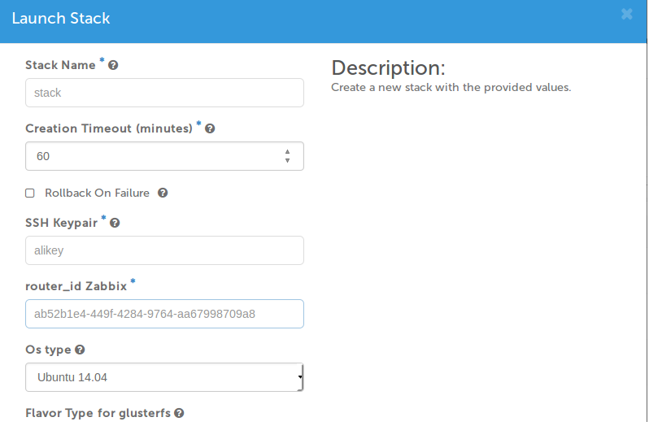
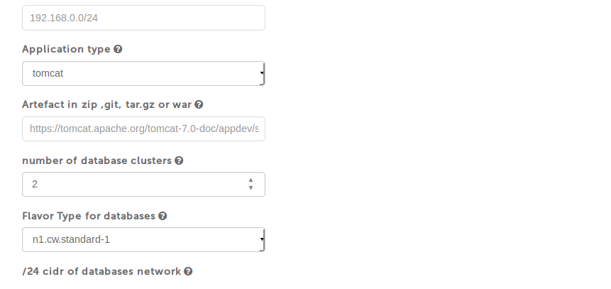
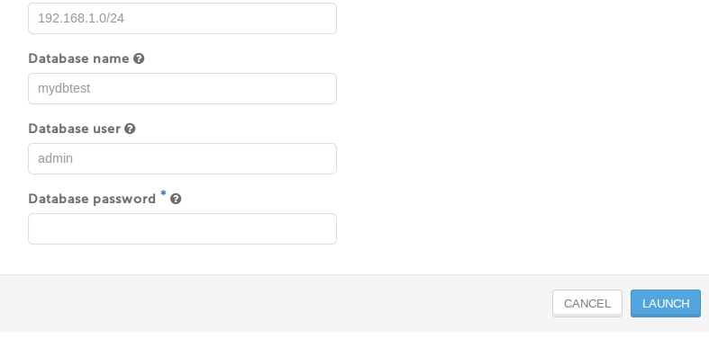
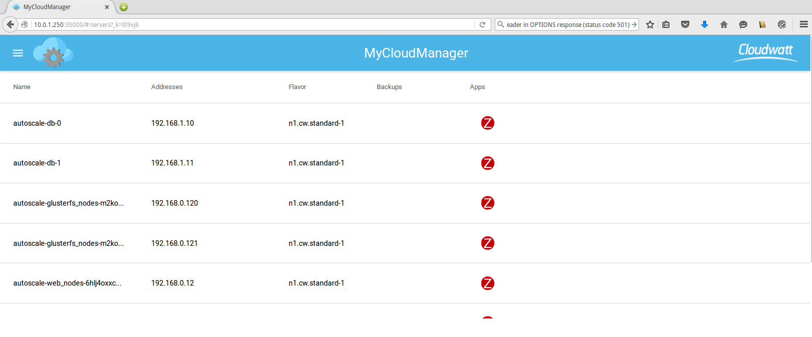
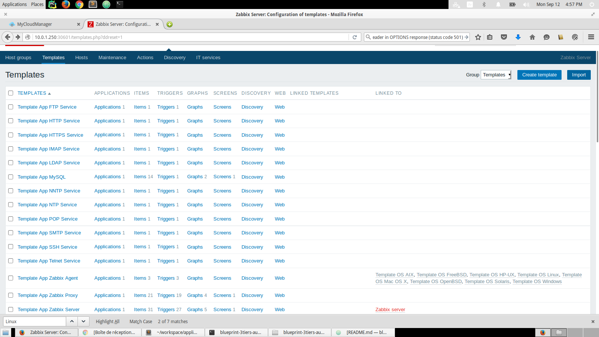
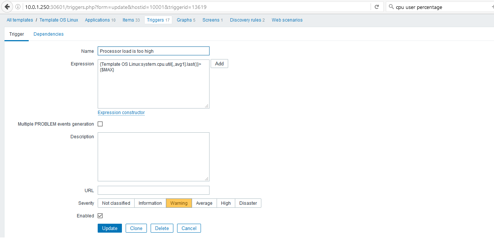

<<<<<<< HEAD
# 5 Minutes Stacks, épisode 27 : Blueprint 3 tiers avec autoscaling via alerte Zabbix #
=======
# 5 Minutes Stacks, épisode 27 : Blueprint 3 tiers avec autoscaling d'instance via un evenement Zabbix de MyCloudManager #
>>>>>>> 1128bd6f177aa1bd80847b617f86b5978fef425a

## Episode 27 : Blueprint 3 tiers avec autoscaling d'instance via un evenement Zabbix de MyCloudManager

Ce blueprint va vous aider à mettre en place une architecture 3-tiers avec un autoscaling group.
Nous avons automatisé le déploiement des différents noeuds composant l'architecture.
A travers ce blueprint nous vous proposons de mettre en place des frontaux web sur la forme de groupe Autoscaling, du glusterfs et un cluster de base de données.
Vous aurez le choix de déployer sur les frontaux web différentes applications (Apache & php, tomcat 8 ou nodejs).
Voici le schema d'architecture :

**Pour rappel** un autoscaling group est un groupe de machine qui est capable de s'adapter à la charge d'une application afin de coller aux besoins de celle-ci lors d'un pique de charge par exemple.

## Preparations

### Les versions
 - Ubuntu Trusty 14.04
 - Ubuntu Xenial 16.04
 - Debian Jessie
 - Centos 7.2
 - Glustefs 3.8
 - Mariadb 10.1
 - Lvm2
 - Mylvmbackup
 - Galeracluster 3.8
 - Nodejs 6.x
 - Apache 2.4
 - Php 5 & 7
 - Openjdk 8
 - Tomcat 9
 - Nginx 1.10
 - Zabbix 3.2

### Les pré-requis

  * Un accès internet
  * Un shell linux
  * Un [compte Cloudwatt](https://www.cloudwatt.com/cockpit/#/create-contact) avec une [ paire de clés existante](https://console.cloudwatt.com/project/access_and_security/?tab=access_security_tabs__keypairs_tab)
  * Les outils [OpenStack CLI](http://docs.openstack.org/cli-reference/content/install_clients.html)

### Initialiser l'environnement

 Munissez-vous de vos identifiants Cloudwatt, et cliquez [ICI](https://console.cloudwatt.com/project/access_and_security/api_access/openrc/).
 Si vous n'êtes pas connecté, vous passerez par l'écran d'authentification, puis le téléchargement d'un script démarrera. C'est grâce à celui-ci que vous pourrez initialiser les accès shell aux API Cloudwatt.

 Sourcez le fichier téléchargé dans votre shell et entrez votre mot de passe lorsque vous êtes invité à utiliser les clients OpenStack.

  ~~~ bash
  $ source COMPUTE-[...]-openrc.sh
  Please enter your OpenStack Password:
  ~~~

 Une fois ceci fait, les outils de ligne de commande d'OpenStack peuvent interagir avec votre compte Cloudwatt.

## Initialiser Blueprint

### En One-click

via l'url https://www.cloudwatt.com/fr/applications/blueprint.html cliquez ensuite sur déployer.

* Remplissez  les champs suivants puis cliquez sur LAUNCH.

**SSH Keypair :** Votre key pair Cloudwatt.

**router-id Stack-Zabbix :** Id du routeur Zabbix.

Connectez en ssh sur le noeud master de votre MyCloudManager puis tapez cette commande.

~~~bash
$ etcdctl get /ssh/key.pub
~~~

**Artefact in zip ,git, tar.gz or war :** Mettez l'url de l'artifact de votre application, il faut qu'il soit en git, zip ou tar.gz pour les applications php et nodejs ou en war pour les applications java.

**Application type :** choisissez ici l'application correspondant à l'artifact précedement copié à savoir php, nodejs ou tomcat

**Flavor Type for nodes :** Choississez le type d'instance des frontaux web.

**Number of front nodes :** Le nombre de noeuds frontaux web.

**Flavor Type for glusterfs :** La flavor des deux noeuds glusterfs.

**/24 cidr of fronts network :** L'adresse réseaux des frontaux web et du glusterfs sous la forme: x.x.x.0/24.

**Database user :** L'utilisateur de la base de données.

**Database password :** Le mot de passe de l'utilisateur de la base de données.

**Database name :** Le nom de la base de données.

**Flavor Type for databases :** Choississez le type d'instance des noeuds de la base de données.

**Number of database clusters :** Le nombre de noeuds de la base de données.

**/24 cidr of databases network :** L'adresse réseaux des noeuds de la base données sous la forme: x.x.x.0/24.

**OS type :** Choisissez l'OS qui vous convient à savoir Ubuntu 14.04, Ubuntu 16.04, Debian Jessie ou Centos 7.2

Voici l'ensemble des composant de la  stack :

Ci-dessous les informations données à la sortie de la stack:

**Database_ip :** L'adresse ip du load balancer du cluster Galera.

**Database_name :** Nom de la base de données.

**Database_user :** Le nom de l'utlisateur de la base de données.

**Database_port :** Le port de la base de données.

**App_url_external :** L'url externe du load balancer des noeuds frontaux web.

**App_url_internal :** L'url interne du load balancer des noeuds frontaux web.

**scale_up_url :** L'url de scale up

**scale_dn_url :** L'url de scale down

## Enjoy

#### Les dossiers et fichiers de configuration pour les noeuds frontaux web:

* php

`/etc/apache2/sites-available/vhost.conf`: Configuration Apache par défaut sur Debian et Ubuntu.

`/etc/http/conf.d/vhost.conf`: Configuration Apache par défaut sur Centos.

`/var/www/html`: Le répertoire de déploiement de l'application php.

* tomcat

`/usr/share/tomcat`: Le dossier de tomcat.

`/user/share/tomcat/webapps`: Le répertoire de déploiement de l'application java

`/etc/nginx/conf.d/default`: Configuration de reverse proxy.

* nodejs

`/nodejs`: Le répertoire de déploiement de l'application nodejs.

`/etc/nginx/conf.d/default`: Configuration de reverse proxy.

#### Les dossiers et fichiers de configuration pour les deux noeuds Glusterfs:

`/srv/gluster/brick`: Le répertoire qui est repliqué entre les deux noeuds glusterfs.

#### Les dossiers et fichiers de configuration pour les noeuds galera:

`/DbStorage/mysql`: le datadir des noeuds Mariadb du volume cinder.

`/etc/mysql`: Le répertoire de configuration de Mariadb sous Debian and Ubuntu.

`/etc/my.cnf`: Le fichier  de configuration de Mariadb sous Centos.  

`/etc/my.cnf.d`: Le répertoire de configuration de Mariadb sous Centos.

#### Redémarrez les services pour chaque type d'application

* php
Sur Debian et ubuntu
~~~ bash
service apache2 restart
~~~
Sur Centos
~~~ bash
service httpd restart
~~~
* nodejs
~~~ bash
service nginx restart
/etc/init.d/nodejs restart
~~~

* tomcat
~~~ bash
service tomcat restart
service nginx restart
~~~

* Glasterfs
Sur Debian et Ubuntu
~~~ bash
service glusterfs-server restart
~~~
Sur Centos
~~~ bash
service glusterd restart
~~~
* Galera

Sur le premier noeud
~~~ bash
service mysql restart --wsrep-new-cluster
~~~
Sur les autres
~~~ bash
service mysql restart
~~~

#### Exploitation

**Les noeuds Frontaux :**

`/root/deploy.sh` : c'est une tache scheduler (cron) pour deployer les applications, vous pouvez l'arrêter si l'application est bien deployée.
Si vous voulez redeployer l'application ou juste supprimez le contenu du dossier de l'application, lancer ces commandes suivantes:
~~~bash
rm -rf /var/www/html/*
##si type de l'application est php.
/root/deploy.sh /var/www/html php url_artifact
##si type de l'application est tomcat
/root/deploy.sh /opt/tomcat/webapps tomcat war_url
##si type de l'application est nodejs
/root/deploy.sh /nodejs nodejs url_artifact
~~~
**Les deux noeuds Glusterfs:**

Le volume gluster est sous la fome ip:/gluster, pour tester qu'il fonctionne bien ,tapez la commande suivante:

~~~bash
gluster volume info
~~~
**Les noeuds dcluster Galera :**

`/root/sync.sh`:  c'est une tache scheduler (cron) pour démarrer les noeuds de Galera, vous pouvez l'arrêter si les noeuds sont bien démarrés,
pour tester si c'est bien le cas tapez la commande suivante:

~~~bash
mysql -u root -e 'SELECT VARIABLE_VALUE as "cluster size" FROM INFORMATION_SCHEMA.GLOBAL_STATUS  WHERE VARIABLE_NAME="wsrep_cluster_size"'
+--------------+
| cluster size |
+--------------+
| nomber de noeuds mariadb |
+--------------+
~~~

**Backup des noeuds Galeracluster :**
Vous avez deux solutions pour le backup de la base de données.

1) Lancez un cron qui fait des snapshots des volumes cinder qui sont attachés aux noeuds de la base de données :

~~~bash
cinder snapshot-create --display-name snapshot_name.$(date +%Y-%m-%d-%H.%M.%S) id_volume
~~~
2) Lancez un cron qui fait des snapshots de la base de données et le met dans un conteneur swift :

~~~bash
#/bin/bash
mylvmbackup --user=root --mycnf=/etc/mysql/my.cnf --vgname=vg0 --lvname=global --backuptype=tar
swift upload your_back_contenair /var/cache/mylvmbackup/backup/*
rm -rf /var/cache/mylvmbackup/backup/*
~~~
**Configuration autoscaling via une alerte zabbix**

#### Ajouter des agents

Installer l'agent Zabbix dans les instances que vous souhaitez monitorer.

#### Mettre à jour le template OS Linux Zabbix

Mettez à jour le `template OS Linux`, ce template contient un nouveau `item` ,deux nouveaux `triggers` et deux nouveaux `macros` afin de calculer  le pourcentage d'utilisation des CPU(s) par minute.

Cliquez sur `Configuration` puis sur `Templates`.

Cliquez sur `Import`, sélectionnez le template `template_os_linux.xml`et cliquez sur `Import`.

#### Créer les deux Actions scale up et scale down

D'abord vous devez disposer des urls de scale up et down que vous retrouverez dans la partie Output de votre stack autoscaling de la console horizon Cloudwatt ou via les commandes CLI suivantes:

  - Url de scale up :

~~~bash
openstack stack output show -f json `nom_de_votre_stack` scale_up_url | jq '.output_value'
~~~

  - Url de scale down :

~~~bash
openstack stack output show -f json `nom_de_votre_stack` scale_dn_url | jq '.output_value'
~~~

A présent nous pouvons passer aux étapes de scale UP et scale Down.

* Créer un `host groups` qui représente vos instances.

* Créer une action de scale down (pour scale up faites la même chose mais avec l'URL scale UP donnée en sortie de votre stack) et
 ajouter les conditions souhaitées.

* Ajouter l'opération souhaitée.

Afin de créer l'action dans Zabbix de scale up ou down.

* Récupérer via votre CLI vos identifiant openstack que vous devriez avec copier dans le fichier .profile de votre user courant ainsi que votre URL de scale (up ou down), former le block ci-dessous.

~~~bash
curl -k -X POST 'url de scaling down ou scaling up'
~~~

* Copiez à présent le tout dans la partie `Command` de Zabbix comme dans l'exemple ci-dessous.

Maintenant votre action est bien créée.

#### Pour tester le scaling up et scaling down, essayez de `Stresser` (faire monter en charge) vos instances , en tapant la commande suivante dans les serveurs:

 ~~~bash
 $ sudo apt-get install stress
 $ stress --cpu 90 --io 2 --vm 2 --vm-bytes 512M --timeout 600
 ~~~

N'oubliez pas d'ajouter chaque nouvelle instance apparue dans le `Host Group` du zabbix afin de la monitorer.

#### Comment customiser votre template

Dans cet article on a utilisé comme item `system.cpu.util[,,avg1]` pour calculer en pourcentage le moyen d'utlisation de CPU(s).
Vous pouvez vous baser sur d'autres items (calculer l'usage de RAM ou disque ...) pour avoir l'autoscaling.
Voilà [une liste des items](https://www.zabbix.com/documentation/2.0/manual/config/items/itemtypes/zabbix_agent)

* Pour créer un item.

* Vous pouvez aussi changer les macros ou en créer autres.

* Vous pouvez aussi créer un trigger.

## So watt ?

Ce tutoriel à pour but d'accélérer votre démarrage. A ce stade vous êtes maître(sse) à bord.

Vous avez un point d'entrée sur votre machine virtuelle en SSH via l'IP flottante exposée et votre clé privée (utilisateur `cloud` par défaut).

### Autres sources pouvant vous intéresser:
* [ Apache Home page](http://www.apache.org/)
* [ Galera Documentation](http://galeracluster.com/support)
* [ Glusterfs Documentation](https://www.gluster.org/)
* [ Tomcat Documentation](http://tomcat.apache.org/)
* [ Nodejs Documentation](https://nodejs.org/en/)
* [ Nginx Documentation](https://www.nginx.com/resources/wiki/)
* [ Autoscaling ](https://dev.cloudwatt.com/fr/blog/passez-votre-infrastructure-openstack-a-l-echelle-avec-heat.html)
* [ Zabbix](https://www.zabbix.com/documentation/3.0/manual/introduction/features)
----
Have fun. Hack in peace.
