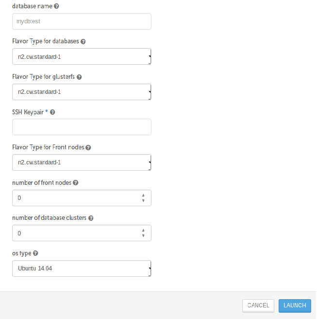
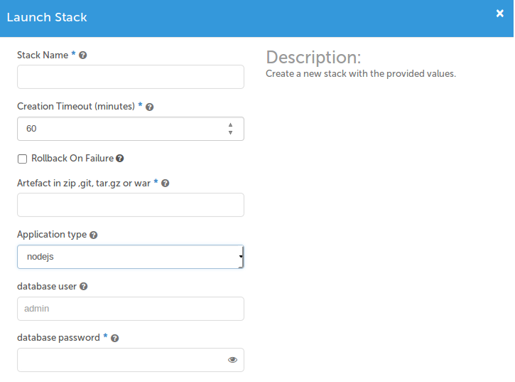
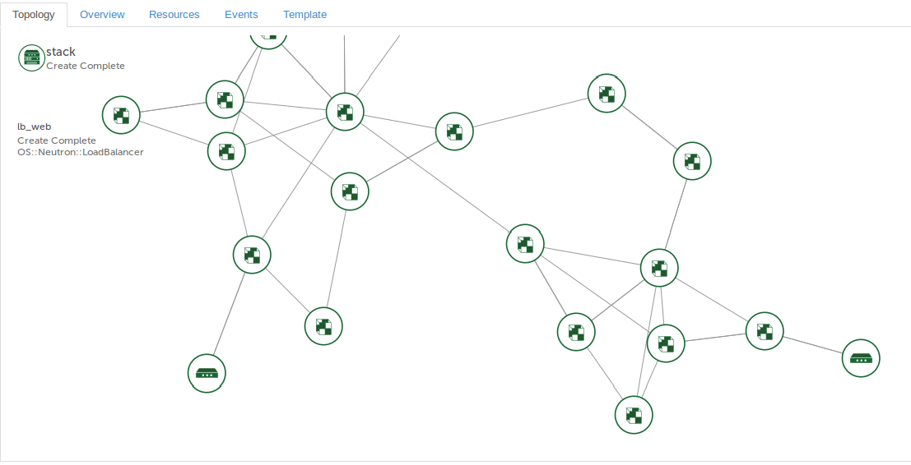
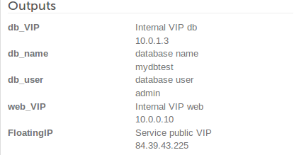

# 5 Minutes Stacks, épisode 26 : Blueprint #

## Episode 26 : Blueprint

Blueprint c'est une architecture 3-tires dont il y a des noeuds fronts , deux noeuds glusterfs et clusters bases de données :

## Preparations

### Les versions
 - Ubuntu Trusty 14.04
 - Ubuntu Xenial 16.04
 - Debian Jessie
 - Centos 7.2
 - Glustefs 3
 - Mariadb 10.1
 - Galera
 - nodejs
 - Apache 2
 - Php 5 and 7
 - openjdk 8
 - Tomcat 8
 - Nodejs 1.10
 - Nginx 1.10

### Les pré-requis

  * Un accès internet
  * Un shell linux
  * Un [compte Cloudwatt](https://www.cloudwatt.com/cockpit/#/create-contact) avec une [ paire de clés existante](https://console.cloudwatt.com/project/access_and_security/?tab=access_security_tabs__keypairs_tab)
  * Les outils [OpenStack CLI](http://docs.openstack.org/cli-reference/content/install_clients.html)

### Initialiser l'environnement

 Munissez-vous de vos identifiants Cloudwatt, et cliquez [ICI](https://console.cloudwatt.com/project/access_and_security/api_access/openrc/).
 Si vous n'êtes pas connecté, vous passerez par l'écran d'authentification, puis le téléchargement d'un script démarrera. C'est grâce à celui-ci que vous pourrez initialiser les accès shell aux API Cloudwatt.

 Sourcez le fichier téléchargé dans votre shell et entrez votre mot de passe lorsque vous êtes invité à utiliser les clients OpenStack.

  ~~~ bash
  $ source COMPUTE-[...]-openrc.sh
  Please enter your OpenStack Password:
  ~~~

 Une fois ceci fait, les outils de ligne de commande d'OpenStack peuvent interagir avec votre compte Cloudwatt.

 ## Installer Blueprint

 ### 1 clic

Remplissez  les champs suivants puis cliquez sur LAUNCH.

**SSH Keypair :** Votre key pair.

**Artefact in zip ,git, tar.gz or war :** Vous mettez l'url de l'artifact de votre application ,il faut qu'il soit en git,zip ou tar.gz  pour les applications php et nodejs et en war pour les applications java.

**Application type :** Si vous choisissez php vous allez avoir un environnement apache2 et php, si vous choisissez nodejs vous allez avoir un environnement qui exécute les applications nodejs avec reverse proxy nginx et si vous choisissez tomcat vous allez avoir un environnement tomcat 8 et openjdk8 avec nginx comme un reverse proxy.

**Flavor Type for nodes :** le flavor pour les noeuds font web.

**Number of front nodes :** nombre des noeudes font web.

**Flavor Type for glusterfs :** le flavor pour les deux noeuds glusterfs.

**/24 cidr of fronts network :** l'addresse de réseaux des noeuds front web et glusterfs sous forme: 192.168.0.0/24.

**Database user :** l'ultisateur de la base de données.

**Database password :** le mot de passe de l'utlisateur de la base de données.

**Database name :** le nom de la bases.

**Flavor Type for databases :** le flavor pour les noeuds de la base de données.

**Number of database clusters :** nombre des noeudes de base de données.

**/24 cidr of databases network :** l'addresse de réseaux des noeuds   de base données sous forme: 192.168.0.0/24.

**OS type :** Vous choisissez l'OS qui vous convient ,soit Ubuntu 14.04 , Ubuntu 16.04 ,Debian Jessie ou Centos 7.2

La forme du stack :

les outputs:

**database_ip :** l'addresse ip de load balancer de base de données clusters

**database_name :** nom de votre base

**database_user :** nom de l'utlisateur de votre base.

**database_port :** le port de la base de données

**App_url_external :** pour accécder votre application à partir d'un navigateur.

**App_url_internal :** pour accécder votre application via le réseau interne.

## Enjoy

**les dossiers et fichiers de configuration pour les noeuds fronts:**

* php

`/etc/apache2/sites-available/vhost.conf`: configuration Apache par défaut sur Debian et Ubuntu.

`/etc/http/conf.d/vhost.conf`:configuration Apache par défaut sur Centos.

`/var/www/html`: le répertoire de déploiement de votre application php.

* tomcat

`/usr/share/tomcat`: le dossier de tomcat.

`/user/share/tomcat/webapps`: le répertoire de déploiement de votre application java

`/etc/nginx/conf.d/default`: configuration de reverse proxy.

* nodejs

`/nodejs`: le répertoire de déploiement de votre application nodejs.

**les dossiers et fichiers de configuration pour les deux noeuds glusterfs:**

`gluster`: le volume qui est repliqué entre entre les deux noeuds.

**les dossiers et fichiers de configuration pour les noeuds galera:**

`/DbStorage/mysql`: le datadir des neudes de Mariadb est installé sur ce dossier qui est un volume cinder.

Pour le backup vous avez deux solutions
la première c'est juste crieer snaphot des volumes cinder attachés aux noeudes des bases de données.
la deuxième le lvm est installé sur les instances vous pouvez utiliser et le volume cinder est un physique volumes PV.
donc vous pouvez utiliser mylvmbackup pour sauvegarder votre base de données et le mettre dans un contenaire swift.

`/etc/mysql`

`/etc/mysql.conf`

`/etc/my.cnf.d`

**Redémarrez les services dans chaque type d'application**

* php
Pour Debian et ubuntu
~~~ bash
# service apache2 restart
~~~
Pour Centos
~~~ bash
# service httpd restart
~~~
* nodejs
~~~ bash
# service nginx restart
# /etc/init.d/nodejs restart
~~~

* tomcat
~~~ bash
# service tomcat restart
# service nginx restart
~~~

* glasterfs
Pour Debian et Ubuntu
~~~ bash
# service httpd restart
~~~
Pour Centos
~~~ bash
# service httpd restart
~~~
* galera
Pour le premièr noeud
~~~ bash
# service mysql restart --wsrep-new-cluster
~~~
Pour les autres
~~~ bash
# service mysql restart
~~~

**scripts exploits**

pour les noeuds front :
/root/deploy.sh : est un cron pour deployer les applications ,vous pouvez l'arreter si l'application est bien deployer.
si vous voulez redeployer votre applications
juste supprimer les contenues de chaques dossier d'applications et lancer le script
exemple:
~~~bash
rm -rf /var/www/html/*
/root/deploy.sh /var/www/html php url_repo
~~~

pour les noeuds de galera
/root/sync.sh: cron pour bien redemmarrer les noeuds de galera ,vous pouvez l'arreter si les Galera est bien deployer pour savoir que
les noeuds marchent bien:

~~~bash
mysql -u root -e 'SELECT VARIABLE_VALUE as "cluster size"  FROM INFORMATION_SCHEMA.GLOBAL_STATUS  WHERE VARIABLE_NAME="wsrep_cluster_size"'
+--------------+
| cluster size |
+--------------+
| nomber de noeuds mariadb            |
+--------------+
~~~

### Autres sources pouvant vous intéresser:
* [ Postfix Home page](http://www.postfix.org/documentation.html)
* [ Dovecot Documentation](http://www.dovecot.org/)
* [ Rainloop Documentation](http://www.rainloop.net)
* [ ClamAv Documentation](http://www.clamav.net/)

----
Have fun. Hack in peace.
