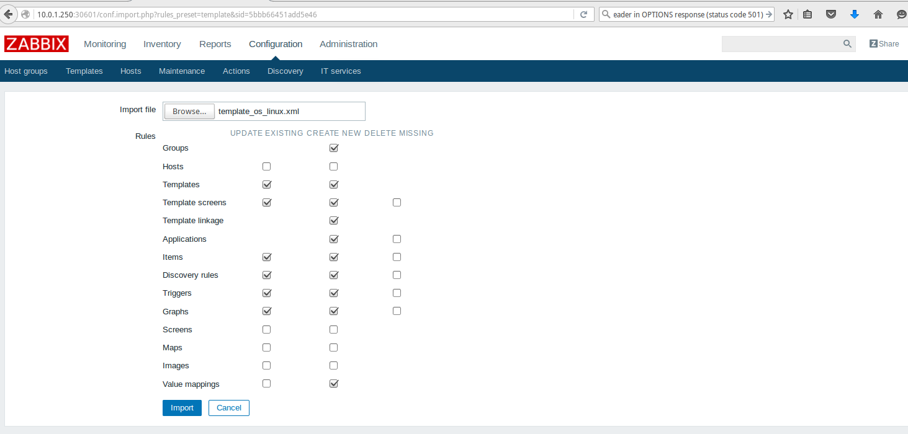
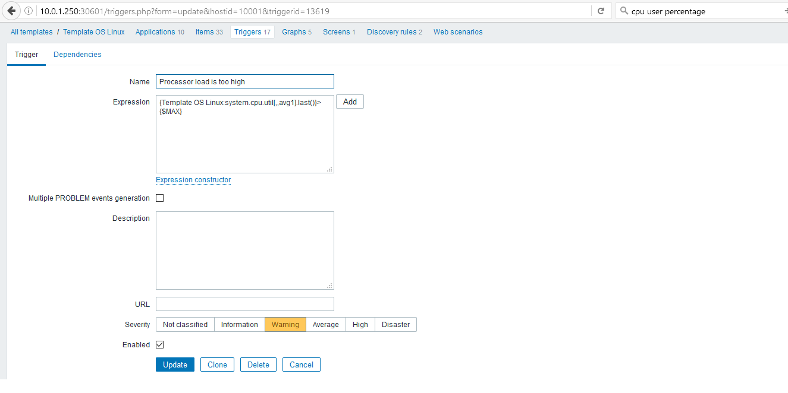

# Instance Autoscaling  via zabbix of MyCloudManager:
  

Auto-scaling, also spelled autoscaling, is a cloud computing service feature that automatically adds or removes compute resources depending upon actual usage. Auto-scaling is sometimes referred to as automatic elasticity.

## Preparations

### The prerequisites

### The version
- MyCloudManager v2
- Zabbix 3.2

### The prerequisites to deploy this stack

 * Internet access
 * A Linux shell
 * A [Cloudwatt account](https://www.cloudwatt.com/cockpit/#/create-contact) with a [valid keypair](https://console.cloudwatt.com/project/access_and_security/?tab=access_security_tabs__keypairs_tab)
 * The tools [OpenStack CLI](http://docs.openstack.org/cli-reference/content/install_clients.html)

### How to get autoscaling via MyCloudManager's Zabbix

#### Lanch  exemple autoscaling stack

##### Adjust the parameters
First, start the stack [MyCloudManager](https://www.cloudwatt.com/fr/applications/mycloudmanager.html) in your piece. Once this is done, you can now retrieve the public key of your MyCloudManager by logging in ssh on the node master of your MyCloudManager and type this command.

~~~ bash
$ etcdctl get /ssh/key.pub
~~~

Recover now router id of MyCloudManager by typing this command :

~~~ bash
$ neutron router-list | `grep nom_stack_myCloudManager`
~~~

In the `blueprint-coreos-mongodb.heat.yml` file (heat template), you will find a section named `parameters` near the top.
 There must inform the id of MyCloudManager router via the `router_id_mcm` parameter and public key previously recovered in the `mcm_public_key` parameter.

 ~~~ yaml
 heat_template_version: 2013-05-23
 description: AutoScaling blueprint exemple
 parameters:
   keypair_name:
     description: Keypair to inject in instance
     default: yourkey   <-- Indicate here your keypair  
     label: SSH Keypair
     type: string
   flavor_name:
     default: n2.cw.standard-1   <-- Indicate here flavor size
     description: Flavor to use for the deployed instance
     type: string
     label: Instance Type (Flavor)
     constraints:
       - allowed_values:
           - t1.cw.tiny
           - s1.cw.small-1
           - n2.cw.standard-1
           - n2.cw.standard-2
           - n2.cw.standard-4
           - n2.cw.standard-8
           - n2.cw.standard-16
           - n2.cw.highmem-2
           - n2.cw.highmem-4
           - n2.cw.highmem-8
           - n2.cw.highmem-12
   net_cidr:                  
     default: 192.168.0.0/24   <-- Indicate here cidr net
     description: /24 cidr of fronts network
     label: /24 cidr of fronts network
     type: string
   router_id_mcm:
     label: router
     type: string
     default: 602565c8-ee30-4697-8a75-044898f381eb     <-- Indicate here MyCloudManager router id
   mcm_public_key:   
     type: string
     label: mcm public key
     default: ssh-rsa AAAAB3NzaC1yc2EAAAADAQABAAABAQD3sBV85fs2QUTKo.....  <-- Indicate here MyCloudManager public key
 ~~~

##### Start the stack

Before starting the stack, open ports 30000,30602 and 30603 in MycloudManager security groupe for your instances can communicate with MyCloudManager, typing the following command.

 ~~~bash
 $ nova secgroup-add-rule `SECURITY_GROUP_MCM` tcp 30000 30000 `cid_net_autoscaling`
 $ nova secgroup-add-rule `SECURITY_GROUP_MCM` tcp 30602 30602 `cid_net_autoscaling`
 $ nova secgroup-add-rule `SECURITY_GROUP_MCM` tcp 30603 30603 `cid_net_autoscaling`
 ~~~

 In a shell, run the following command:

 ~~~bash
 $ heat stack-create `your_stack_name` -f blueprint-autoscaling-exemple.heat.yaml

 +--------------------------------------+-----------------+--------------------+----------------------+
 | id                                   | stack_name      | stack_status       | creation_time        |
 +--------------------------------------+-----------------+--------------------+----------------------+
 | ee873a3a-a306-4127-8647-4bc80469cec4 | your_stack_name       | CREATE_IN_PROGRESS | 2015-11-25T11:03:51Z |
 +--------------------------------------+-----------------+--------------------+----------------------+
 ~~~

 Wait a few minutes the stack will be fully operational.

 ~~~bash
 $ heat resource-list your_stack_name
 +-----------------------------+-------------------------------------------------------------------------------------+------------------------------+-----------------+----------------------+
 | resource_name               | physical_resource_id                                                                | resource_type                | resource_status | updated_time         |
 +-----------------------------+-------------------------------------------------------------------------------------+------------------------------+-----------------+----------------------+
 | asg                         | bde4a6ff-c684-4458-82fe-358337ff43bb                                                | OS::Heat::AutoScalingGroup   | CREATE_COMPLETE | 2016-09-13T14:30:06Z |
 | interface                   | 602565c8-ee30-4697-8a75-044898f381eb:subnet_id=ad09494b-7d90-4c80-8528-1e4c28df598b | OS::Neutron::RouterInterface | CREATE_COMPLETE | 2016-09-13T14:30:06Z |
 | lb                          |                                                                                     | OS::Neutron::LoadBalancer    | CREATE_COMPLETE | 2016-09-13T14:30:06Z |
 | lb_floating                 | b73ebb6f-b89f-4325-90d0-f68592c2a978                                                | OS::Neutron::FloatingIP      | CREATE_COMPLETE | 2016-09-13T14:30:06Z |
 | net                         | 616c6ae1-1968-40cd-9164-c11f1ee5accd                                                | OS::Neutron::Net             | CREATE_COMPLETE | 2016-09-13T14:30:06Z |
 | pool                        | 93199df3-1e06-4083-bdd1-c2a8d341add8                                                | OS::Neutron::Pool            | CREATE_COMPLETE | 2016-09-13T14:30:06Z |
 | sec_group                   | 13d91e55-5ef1-4e1e-88c5-66e467fef632                                                | OS::Neutron::SecurityGroup   | CREATE_COMPLETE | 2016-09-13T14:30:06Z |
 | subnet                      | ad09494b-7d90-4c80-8528-1e4c28df598b                                                | OS::Neutron::Subnet          | CREATE_COMPLETE | 2016-09-13T14:30:06Z |
 | web_server_scaledown_policy | 599b3a451758428db4d8ae97c611ac9b                                                    | OS::Heat::ScalingPolicy      | CREATE_COMPLETE | 2016-09-13T14:30:06Z |
 | web_server_scaleup_policy   | 9b12ca669d6a4e88b2494671c79a98e6                                                    | OS::Heat::ScalingPolicy      | CREATE_COMPLETE | 2016-09-13T14:30:06Z |
 +-----------------------------+-------------------------------------------------------------------------------------+------------------------------+-----------------+----------------------+

 ~~~

#### Add nodes to MyCloudManager 's Zabbix

Install zabbix agent in instances via the web interface of MyCloudManager.
 

#### Update OS Linux Zabbix template

 Update the Linux OS template, this template contains a new `item`, two new triggers` and two new `macors` in order to calculate the percentage use of the CPU(s) in every minute.

Click on `Configuration` then `Templates`.

 

 Then select the `template_os_linux.xml`template and click on `Import`.

 

#### Create the both actions scale up and scale down

 First of all you need to have the urls to scale up and down, you find them in the output portion of your stack autoscaling of Cloudwatt horizon console or through the following CLI commands:

   - Url de scale up :

 ~~~bash
 openstack stack output show -f json `your_stack_name` scale_up_url | jq '.output_value'
 ~~~

   - Url de scale down :

 ~~~bash
 openstack stack output show -f json `your_stack_name` scale_dn_url | jq '.output_value'
 ~~~

Now we can go to scale Up steps and Scale Down.

 * Create `host groups` who represents your instances.

 

 * Create an action of scale down (for scale up do the same things juste your change the URL scale down by URL scale up) and
add the desired conditions.

 

* Add the desired operation.

 

 In order to create the action in Zabbix to scale up or down.

* Recover your OpenStack identifying via CLI, with that you should copy the profile file of your current user and scale your URL (up or down), form the block below.

~~~bash
 export OS_AUTH_URL=https://identity.fr1.cloudwatt.com/v2.0
 export OS_TENANT_ID=xxxxxxxxxxxxxxxxxxxxxxxxxx
 export OS_TENANT_NAME="xxxxxxxxxxxxxxxxxxxxx"
 export OS_PROJECT_NAME="xxxxxxxxxxxxxxxxxxxxx"
 export OS_USERNAME="xxxxxxxxxxxxxxx@cloudwatt.com"
 export OS_PASSWORD=*************************
 export OS_REGION_NAME="fr1"
 curl -k -X POST “url de scaling down ou scaling up“
~~~

 

 Now your action is created.

 

#### For testing the scaling up and scaling down, try `Stress` your instances by typing the following command in the server:

~~~bash
$ sudo apt-get install stress
$ stress --cpu 90 --io 2 --vm 2 --vm-bytes 512M --timeout 600
~~~

Don't forget to add each new stack appeared in the `Host Groupe` of your stack.

#### How to customize your template

In this article we used as `system.cpu.util [,, AVG1]` item in order to calculate cpu usage poucentage.
You can use others items (usage of RAM or disk ...) for the autoscaling.
That [a list of items](https://www.zabbix.com/documentation/2.0/manual/config/items/itemtypes/zabbix_agent)

 * For creating item.

* You can also change or create others.

* You can create a trigger.

### Other resources you could be interested in:

 * [ Autoscaling ](https://dev.cloudwatt.com/fr/blog/passez-votre-infrastructure-openstack-a-l-echelle-avec-heat.html)
 * [ Zabbix](https://www.zabbix.com/documentation/3.0/manual/introduction/features)
 * [ MycloudManager ](https://www.cloudwatt.com/fr/applications/mycloudmanager.html)

 -----
 Have fun. Hack in peace.

 The CAT
