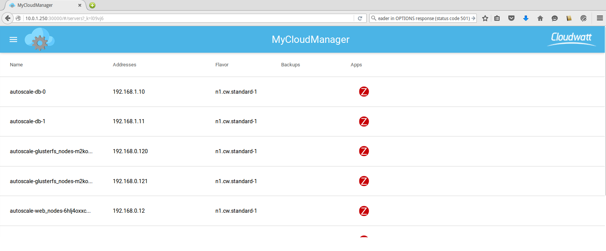
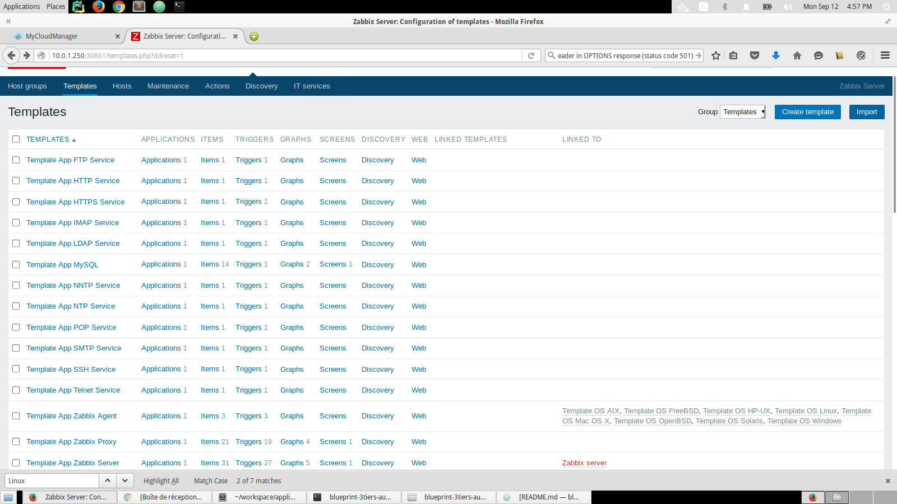
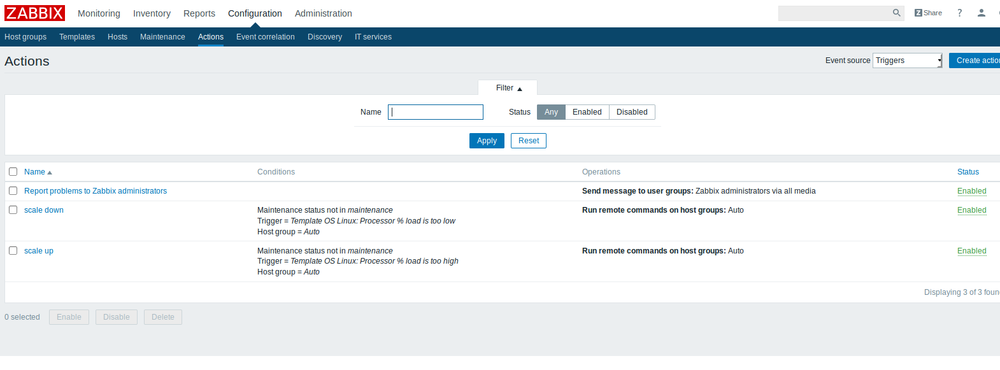

# Autoscaling via zabbix de MyCloudManager
 
Auto-scaling, autoscaling également orthographié, est une caractéristique de service de cloud computing qui ajoute ou supprime les ressources calcul en fonction de l'utilisation réelle automatiquement. Mise à l'échelle automatique est parfois appelée élasticité automatique.

## Préparations

### Les versions
  - MyCloudManager v2
  - zabbix 3

### Les pré-requis

 * Un accès internet
 * Un shell linux
 * Un [compte Cloudwatt](https://www.cloudwatt.com/cockpit/#/create-contact) avec une [ paire de clés existante](https://console.cloudwatt.com/project/access_and_security/?tab=access_security_tabs__keypairs_tab)
 * Les outils [OpenStack CLI](http://docs.openstack.org/cli-reference/content/install_clients.html)
 * MycloudManager V2 [lien] (https://github.com/cloudwatt/applications/blob/master/application-mycloudmanager-v2/README.md)

### Comment avoir l'autoscaling via zabbix de MyCloudManager

#### 1/ Lancer stack exemple autoscaling

##### Ajuster les paramètres

Dans le fichier `blueprint-autoscaling-exemple.heat.yml` vous trouverez en haut une section `parameters`.

~~~ yaml
heat_template_version: 2013-05-23
description: AutoScaling blueprint exemple
parameters:
  keypair_name:
    description: Keypair to inject in instance
    default: votrekey   <-- Indiquer ici votre paire de clés par défaut
    label: SSH Keypair
    type: string

  flavor_name:
    default: n2.cw.standard-1   <-- Indiquer ici la taille de l’instance par défaut
    description: Flavor to use for the deployed instance
    type: string
    label: Instance Type (Flavor)
    constraints:
      - allowed_values:
          - t1.cw.tiny
          - s1.cw.small-1
          - n2.cw.standard-1
          - n2.cw.standard-2
          - n2.cw.standard-4
          - n2.cw.standard-8
          - n2.cw.standard-16
          - n2.cw.highmem-2
          - n2.cw.highmem-4
          - n2.cw.highmem-8
          - n2.cw.highmem-12
  net_cidr:               <-- Indiquer ici la taille de l’instance par défaut
    default: 192.168.0.0/24
    description: /24 cidr of fronts network
    label: /24 cidr of fronts network
    type: string

  router:
    label: router
    type: string
    default: 602565c8-ee30-4697-8a75-044898f381eb    <-- Indiquer ici la taille de l’instance par défaut
  mcm_public_key:
    type: string
    label: mcm public key
    default: ssh-rsa AAAAB3NzaC1yc2EAAAADAQABAAABAQD3sBV85fs2QUTKo.....  <-- Indiquer ici la taille de l’instance par défaut
~~~

##### Démarrer la stack

Avant de lancer la stack ajouter l'autorisation du port 30000 pour le réseau de la stack pour mcm

~~~bash
$ nova secgroup-add-rule SECURITY_GROUP_MCM tcp 30000 30000 cid_net_autoscaling
~~~

Puis dans le shell lancer la commande suivante :

~~~bash
$ heat stack-create nom_de_votre_stack -f blueprint-autoscaling-exemple.heat.yaml

+--------------------------------------+-----------------+--------------------+----------------------+
| id                                   | stack_name      | stack_status       | creation_time        |
+--------------------------------------+-----------------+--------------------+----------------------+
| ee873a3a-a306-4127-8647-4bc80469cec4 | nom_de_votre_stack       | CREATE_IN_PROGRESS | 2015-11-25T11:03:51Z |
+--------------------------------------+-----------------+--------------------+----------------------+
~~~

Puis attendez quelques minutes que le déploiement soit complet.

~~~bash
$ heat resource-list nom_de_votre_stack
+-----------------------------+-------------------------------------------------------------------------------------+------------------------------+-----------------+----------------------+
| resource_name               | physical_resource_id                                                                | resource_type                | resource_status | updated_time         |
+-----------------------------+-------------------------------------------------------------------------------------+------------------------------+-----------------+----------------------+
| asg                         | bde4a6ff-c684-4458-82fe-358337ff43bb                                                | OS::Heat::AutoScalingGroup   | CREATE_COMPLETE | 2016-09-13T14:30:06Z |
| interface                   | 602565c8-ee30-4697-8a75-044898f381eb:subnet_id=ad09494b-7d90-4c80-8528-1e4c28df598b | OS::Neutron::RouterInterface | CREATE_COMPLETE | 2016-09-13T14:30:06Z |
| lb                          |                                                                                     | OS::Neutron::LoadBalancer    | CREATE_COMPLETE | 2016-09-13T14:30:06Z |
| lb_floating                 | b73ebb6f-b89f-4325-90d0-f68592c2a978                                                | OS::Neutron::FloatingIP      | CREATE_COMPLETE | 2016-09-13T14:30:06Z |
| net                         | 616c6ae1-1968-40cd-9164-c11f1ee5accd                                                | OS::Neutron::Net             | CREATE_COMPLETE | 2016-09-13T14:30:06Z |
| pool                        | 93199df3-1e06-4083-bdd1-c2a8d341add8                                                | OS::Neutron::Pool            | CREATE_COMPLETE | 2016-09-13T14:30:06Z |
| sec_group                   | 13d91e55-5ef1-4e1e-88c5-66e467fef632                                                | OS::Neutron::SecurityGroup   | CREATE_COMPLETE | 2016-09-13T14:30:06Z |
| subnet                      | ad09494b-7d90-4c80-8528-1e4c28df598b                                                | OS::Neutron::Subnet          | CREATE_COMPLETE | 2016-09-13T14:30:06Z |
| web_server_scaledown_policy | 599b3a451758428db4d8ae97c611ac9b                                                    | OS::Heat::ScalingPolicy      | CREATE_COMPLETE | 2016-09-13T14:30:06Z |
| web_server_scaleup_policy   | 9b12ca669d6a4e88b2494671c79a98e6                                                    | OS::Heat::ScalingPolicy      | CREATE_COMPLETE | 2016-09-13T14:30:06Z |
+-----------------------------+-------------------------------------------------------------------------------------+------------------------------+-----------------+----------------------+

~~~

#### 2/ Ajouter les noeuds à Zabbix de MycloudManager

Install zabbix agent dans les instances via l'interface web de MyCloudManager

#### 3/ Mise à jour le template OS Linux Zabbix
Mettez à jour le template OS Linux, ce template contient un nouveau item et 2 neaveaux triggers afin de calculer la pourcentage d'utilsation du cpu dans chaque 1 Minutes.

Puis sélectionnez le tempate et cliquez sur import

#### 4/ Créer les Actions scale up et scale download

Pour disposer des urls de scale up et down, vous devez interroger les sorties (Output) de votre stack via la commande Url de scale up :

~~~bash
openstack stack output show  -f json  autoscale scale_up_url | jq '.output_value'
~~~

Url de scale down :

~~~bash
openstack stack output show  -f json  autoscale scale_dn_url | jq '.output_value'
~~~

Les étapes pour créer les deux actions scale up et scale down:

1/ Créer par exemple un host groups qui contient les instances.

2/ Créer l'action scale down (pour scale up c'est de la méme manière juste changez l'url)

Ajouter les conditions.

Mettez les commandes de scale down (scale up)

la commande
~~~bash
export OS_AUTH_URL=https://identity.fr1.cloudwatt.com/v2.0
export OS_TENANT_ID=xxxxxxxxxxxxxxxxxxxxxxxxxx
export OS_TENANT_NAME="xxxxxxxxxxxxxxxxxxxxx"
export OS_PROJECT_NAME="xxxxxxxxxxxxxxxxxxxxx"
export OS_USERNAME="xxxxxxxxxxxxxxx@cloudwatt.com"
export OS_PASSWORD=*************************
export OS_REGION_NAME="fr1"
curl -k -X POST “url de scaling down ou scaling up“

~~~

Votre action est déjà créé

N'oubliez pas d'ajouter chaque nouveau stack apparu dans le Host Groupe de votre stack.

### Autres sources pouvant vous intéresser:
* [ Autoscaling ](https://dev.cloudwatt.com/fr/blog/passez-votre-infrastructure-openstack-a-l-echelle-avec-heat.html)
* [ Zabbix](https://www.zabbix.com/documentation/3.0/manual/introduction/features)
* [ MycloudManager ](https://www.cloudwatt.com/fr/applications/mycloudmanager.html)

-----
Have fun. Hack in peace.

The CAT
