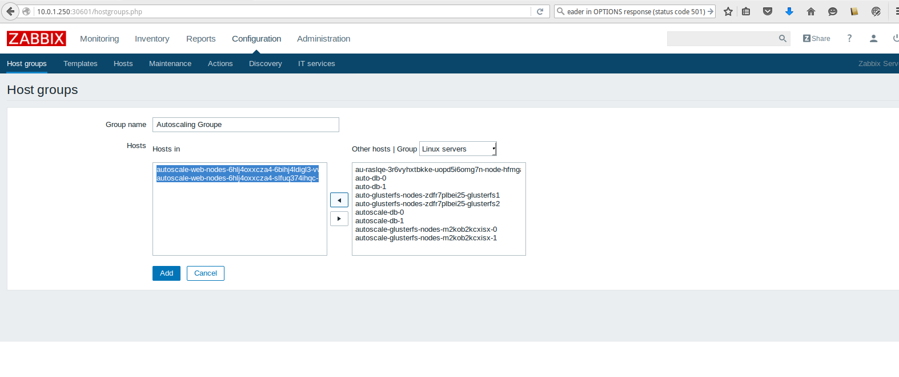
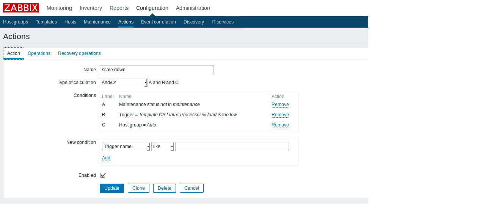
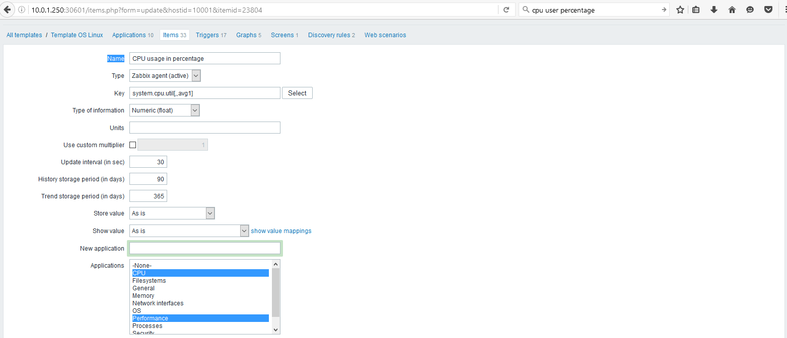

# Autoscaling d'instance via un evenement Zabbix de MyCloudManager
   

L'autoscaling, est l'une des caractéristiques du cloud computing qui permet d'ajouter ou supprimer des ressources en fonction de l'utilisation réelle d'une application de façon automatique.La mise à l'échelle automatique est aussi appelée parfois élasticité automatique.

L'objectif dans cet article comment obtenir l'autoscaling en configurant Zabbix de MyCloudManager.
## Préparations

### Les versions
  - MyCloudManager v2
  - Zabbix 3.2

### Les pré-requis

 * Un accès internet
 * Un shell linux
 * Un [compte Cloudwatt](https://www.cloudwatt.com/cockpit/#/create-contact) avec une [ paire de clés existante](https://console.cloudwatt.com/project/access_and_security/?tab=access_security_tabs__keypairs_tab)
 * Les outils [OpenStack CLI](http://docs.openstack.org/cli-reference/content/install_clients.html)
 * MycloudManager V2 [lien] (https://github.com/cloudwatt/applications/blob/master/application-mycloudmanager-v2/README.md)

### Comment optenir l'autoscaling via le Zabbix de MyCloudManager

#### 1/ Lancer une stack d'exemple avec l'option d'autoscaling

##### Ajuster les paramètres

Dans un premier temps, lancer la stack [MyCloudManager](https://www.cloudwatt.com/fr/applications/mycloudmanager.html) dans votre tenant. Une fois cette opération effectuée, vous pouvez à présent récupérer la clé publique de votre MyCloudManager en Connectant avec ssh sur le master de votre MyCloudManager et en tapant cette commande.
~~~bash
$ etcdctl get /ssh/key.pub
~~~

Récupérez à présent l'id de votre routeur MyCloudManager en tapant cette commande:
~~~bash
$ neutron router-list | grep nom_stack_myCloudManager
~~~

Dans le fichier `blueprint-autoscaling-exemple.heat.yml`. Vous y trouverez en haut une section `parameters`. Il faut y renseigner le routeur de votre MyCloudManager via le paramètre `router` et la clé publique précédement récupérée `mcm_public_key`.

~~~ yaml
heat_template_version: 2013-05-23
description: AutoScaling blueprint exemple
parameters:
  keypair_name:
    description: Keypair to inject in instance
    default: votrekey   <-- Indiquer ici votre paire de clés par défaut
    label: SSH Keypair
    type: string

  flavor_name:
    default: n2.cw.standard-1   <-- Indiquer ici la taille de l’instance par défaut
    description: Flavor to use for the deployed instance
    type: string
    label: Instance Type (Flavor)
    constraints:
      - allowed_values:
          - t1.cw.tiny
          - s1.cw.small-1
          - n2.cw.standard-1
          - n2.cw.standard-2
          - n2.cw.standard-4
          - n2.cw.standard-8
          - n2.cw.standard-16
          - n2.cw.highmem-2
          - n2.cw.highmem-4
          - n2.cw.highmem-8
          - n2.cw.highmem-12
  net_cidr:              
    default: 192.168.0.0/24   <-- Indiquer ici la taille de l’instance par défaut
    description: /24 cidr of fronts network
    label: /24 cidr of fronts network
    type: string

  router_id_mcm:
    label: router id mcm
    type: string
    default: 602565c8-ee30-4697-8a75-044898f381eb    <-- Indiquer ici la taille de l’instance par défaut
  mcm_public_key:
    type: string
    label: mcm public key
    default: ssh-rsa AAAAB3NzaC1yc2EAAAADAQABAAABAQD3sBV85fs2QUTKo.....  <-- Indiquer ici la taille de l’instance par défaut
~~~

##### Démarrer la stack

Avant de lancer le stack, ouvrez le port 30000 dans le security groupe de MyCloudManager pour que vos instances puissent se communiquer avec MyCloudManager, en tapant la commande suivante.

~~~bash
$ nova secgroup-add-rule `SECURITY_GROUP_MCM` tcp 30000 30000 `cid_net_autoscaling`
~~~

Puis dans le shell lancez la commande suivante :

~~~bash
$ heat stack-create `nom_de_votre_stack` -f blueprint-autoscaling-exemple.heat.yaml

+--------------------------------------+-----------------+--------------------+----------------------+
| id                                   | stack_name      | stack_status       | creation_time        |
+--------------------------------------+-----------------+--------------------+----------------------+
| ee873a3a-a306-4127-8647-4bc80469cec4 | nom_de_votre_stack       | CREATE_IN_PROGRESS | 2015-11-25T11:03:51Z |
+--------------------------------------+-----------------+--------------------+----------------------+
~~~

Puis attendez quelques minutes que le déploiement soit complet.

~~~bash
$ heat resource-list `nom_de_votre_stack`
+-----------------------------+-------------------------------------------------------------------------------------+------------------------------+-----------------+----------------------+
| resource_name               | physical_resource_id                                                                | resource_type                | resource_status | updated_time         |
+-----------------------------+-------------------------------------------------------------------------------------+------------------------------+-----------------+----------------------+
| asg                         | bde4a6ff-c684-4458-82fe-358337ff43bb                                                | OS::Heat::AutoScalingGroup   | CREATE_COMPLETE | 2016-09-13T14:30:06Z |
| interface                   | 602565c8-ee30-4697-8a75-044898f381eb:subnet_id=ad09494b-7d90-4c80-8528-1e4c28df598b | OS::Neutron::RouterInterface | CREATE_COMPLETE | 2016-09-13T14:30:06Z |
| lb                          |                                                                                     | OS::Neutron::LoadBalancer    | CREATE_COMPLETE | 2016-09-13T14:30:06Z |
| lb_floating                 | b73ebb6f-b89f-4325-90d0-f68592c2a978                                                | OS::Neutron::FloatingIP      | CREATE_COMPLETE | 2016-09-13T14:30:06Z |
| net                         | 616c6ae1-1968-40cd-9164-c11f1ee5accd                                                | OS::Neutron::Net             | CREATE_COMPLETE | 2016-09-13T14:30:06Z |
| pool                        | 93199df3-1e06-4083-bdd1-c2a8d341add8                                                | OS::Neutron::Pool            | CREATE_COMPLETE | 2016-09-13T14:30:06Z |
| sec_group                   | 13d91e55-5ef1-4e1e-88c5-66e467fef632                                                | OS::Neutron::SecurityGroup   | CREATE_COMPLETE | 2016-09-13T14:30:06Z |
| subnet                      | ad09494b-7d90-4c80-8528-1e4c28df598b                                                | OS::Neutron::Subnet          | CREATE_COMPLETE | 2016-09-13T14:30:06Z |
| web_server_scaledown_policy | 599b3a451758428db4d8ae97c611ac9b                                                    | OS::Heat::ScalingPolicy      | CREATE_COMPLETE | 2016-09-13T14:30:06Z |
| web_server_scaleup_policy   | 9b12ca669d6a4e88b2494671c79a98e6                                                    | OS::Heat::ScalingPolicy      | CREATE_COMPLETE | 2016-09-13T14:30:06Z |
+-----------------------------+-------------------------------------------------------------------------------------+------------------------------+-----------------+----------------------+

~~~

#### Ajouter les noeuds à Zabbix de MycloudManager

Installer l'agent Zabbix dans les instances que vous souhaitez monitorer via l'interface web de MyCloudManager.

#### Mettre à jour le template OS Linux Zabbix

Mettez à jour le `template OS Linux`, ce template contient un nouveau `item` ,deux nouveaux `triggers` et deux nouveaux `macros` afin de calculer  le pourcentage d'utilisation des cpu par minute.

Cliquez sur `Configuration` puis sur `Templates`.

Cliquez sur `Import`, sélectionnez le template `template_os_linux.xml`et cliquez sur `Import`.

#### Créer les deux Actions scale up et scale down

D'abord vous devez disposer des urls de scale up et down que vous retrouverez dans la partie Output de votre stack myCloudManager sur la console Horizon ou via les commandes suivantes:

  - Url de scale up :

~~~bash
openstack stack output show -f json `nom_de_votre_stack` `scale_up_url` | jq '.output_value'
~~~

  - Url de scale down :

~~~bash
openstack stack output show -f json `nom_de_votre_stack` `scale_dn_url` | jq '.output_value'
~~~

A présent nous pouvons passer aux étapes de scale UP et scale Down

* Créer `host groups` qui représente vos instances.

* Créer l'action scale down (pour scale up utilisez les mêmes étapes juste changez l'url).

* Ajouter les conditions.

Afin de créer l'action dans Zabbix de scale up ou down.

* Récupérer via votre CLI vos identifiant openstack que vous devriez avec copier dans le fichier .profile de votre user courant.

~~~bash
export OS_AUTH_URL=https://identity.fr1.cloudwatt.com/v2.0
export OS_TENANT_ID=xxxxxxxxxxxxxxxxxxxxxxxxxx
export OS_TENANT_NAME="xxxxxxxxxxxxxxxxxxxxx"
export OS_PROJECT_NAME="xxxxxxxxxxxxxxxxxxxxx"
export OS_USERNAME="xxxxxxxxxxxxxxx@cloudwatt.com"
export OS_PASSWORD=*************************
export OS_REGION_NAME="fr1"

* Récupérer maintenant votre URL de scale

~~~
curl -k -X POST “url de scaling down ou scaling up“
~~~

* Copiez à présent le tout dans la partie `Command` de Zabbix comme dans l'exemple ci-dessous.

A présent votre action est bien créée.

#### Pour tester le scaling up et scaling down, tapez la commande suivante dans les serveurs:

 ~~~bash
 $ sudo apt-get install stress
 $ stress --cpu 90 --io 2 --vm 2 --vm-bytes 512M --timeout 600
 ~~~

N'oubliez pas d'ajouter chaque nouvelle stack apparue dans le `Host Group` dans le zabbix de MyCloudManager afin de la monitorer.

#### Comment customiser votre template

Dans cet article on a utilisé comme item `system.cpu.util[,,avg1]` pour calculer en pourcentage le moyen d'utlisation de CPU(s).
Vous pouvez vous baser sur d'autres items (calculer l'usage de RAM ou disque ...) pour avoir l'autoscaling.
Voilà [une liste des items](https://www.zabbix.com/documentation/2.0/manual/config/items/itemtypes/zabbix_agent)

Pour créer un item.

Vous pouvez aussi changer les macros ou créer autres.

Vous pouvez créer un trigger.

### Autres sources pouvant vous intéresser:

* [ Autoscaling ](https://dev.cloudwatt.com/fr/blog/passez-votre-infrastructure-openstack-a-l-echelle-avec-heat.html)
* [ Zabbix](https://www.zabbix.com/documentation/3.0/manual/introduction/features)
* [ MycloudManager ](https://www.cloudwatt.com/fr/applications/mycloudmanager.html)

-----
Have fun. Hack in peace.

The CAT
