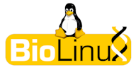
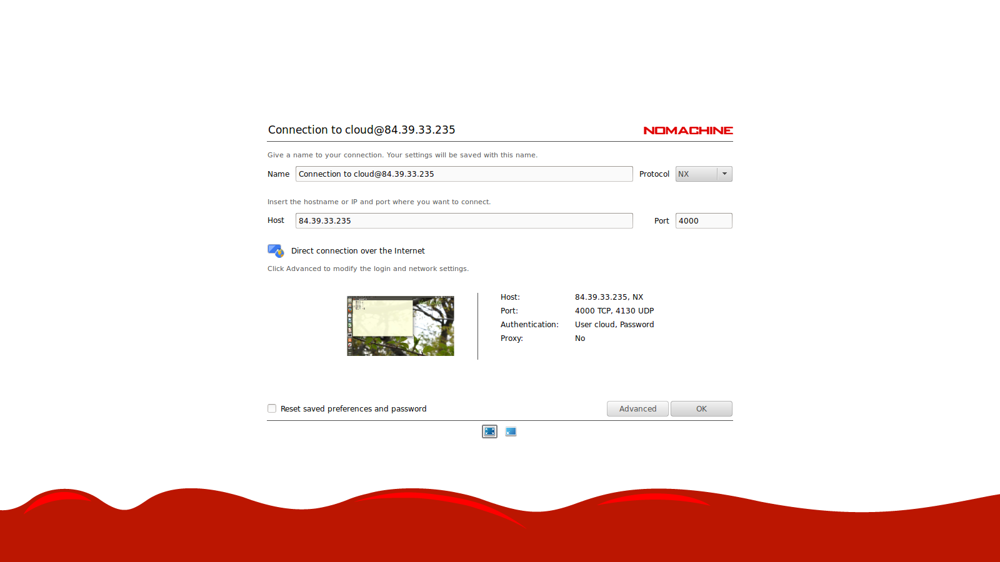
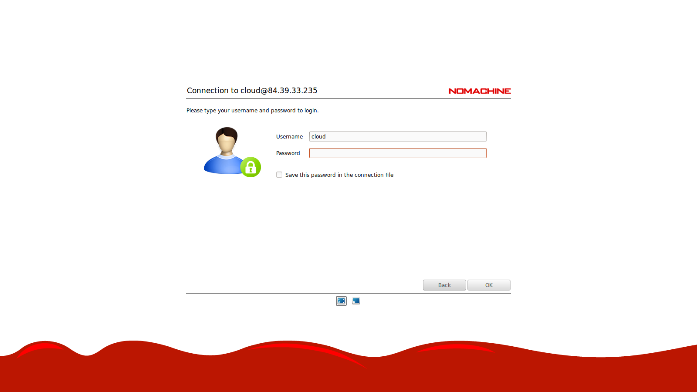
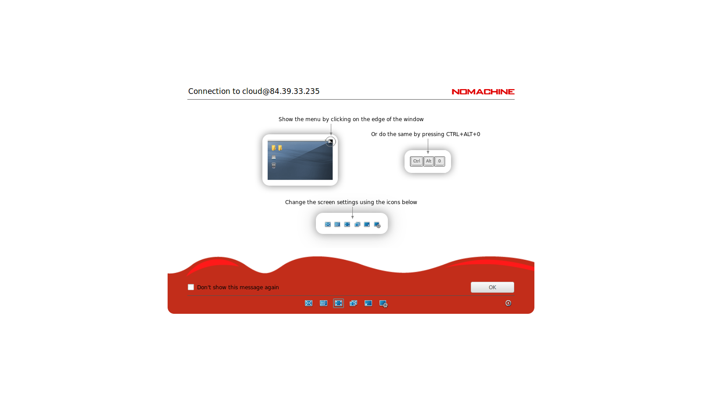
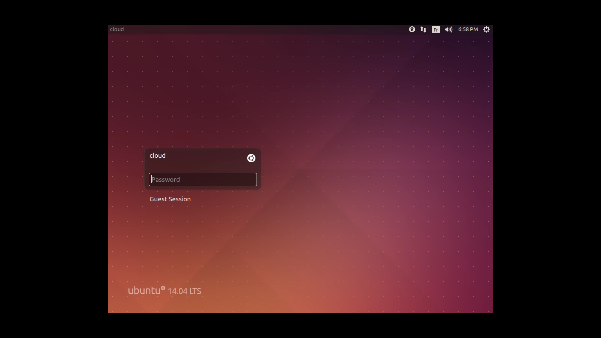
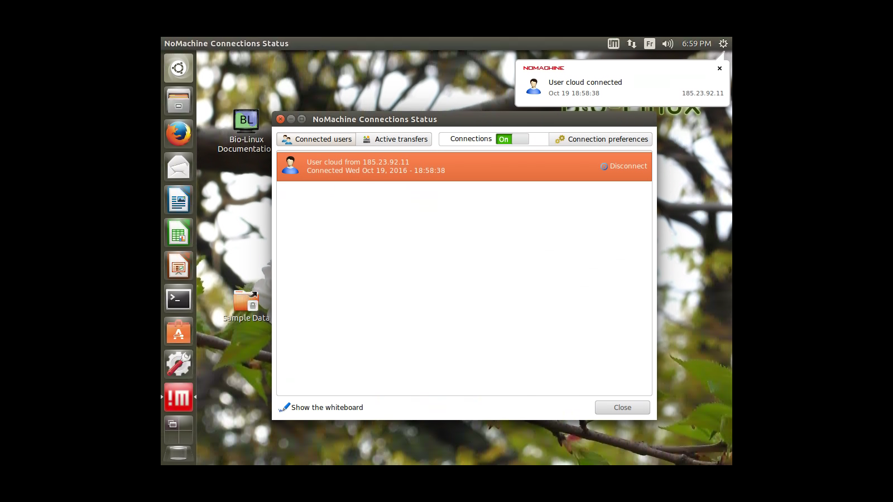

# 5 Minutes Stacks, épisode premier : BioLinux #

## Episode 25 : BioLinux

### Les versions

* BioLinux 8

### Les pré-requis pour déployer cette stack

* un accès internet
* un shell Linux
* un [compte Cloudwatt](https://www.cloudwatt.com/cockpit/#/create-contact), avec une [paire de clés existante](https://console.cloudwatt.com/project/access_and_security/?tab=access_security_tabs__keypairs_tab)
* les outils [OpenStack CLI](http://docs.openstack.org/cli-reference/content/install_clients.html)
* un clone local du dépôt git [Cloudwatt applications](https://github.com/cloudwatt/applications)

### Taille de l'instance

Par défaut, le script propose un déploiement sur une instance de type " Small " (s1.cw.small-1) en tarification à l'usage (les prix à l'heure et au mois sont disponibles sur la [page Tarifs](https://www.cloudwatt.com/fr/produits/tarifs.html) du site de Cloudwatt). Bien sur, vous pouvez ajuster les parametres de la stack et en particulier sa taille par défaut.

## Démarrage

### Initialiser l'environnement

Munissez-vous de vos identifiants Cloudwatt, et cliquez [ICI](https://console.cloudwatt.com/project/access_and_security/api_access/openrc/). Si vous n'êtes pas connecté, vous passerez par l'écran d'authentification, puis le téléchargement d'un script démarrera. C'est grâce à celui-ci que vous pourrez initialiser les accès shell aux API Cloudwatt.

Sourcez le fichier téléchargé dans votre shell. Votre mot de passe vous sera demandé.

~~~ bash
$ source COMPUTE-[...]-openrc.sh
Please enter your OpenStack Password:

~~~

Une fois ceci fait, les outils ligne de commande OpenStack peuvent interagir avec votre compte Cloudwatt.

### Démarrer une instance BioLinux

Dans un shell, lancer cette commande.

~~~bash
$ nova boot --flavor m1.tiny --image bundle-biolinux-8 --nic net-id=NET_ID --security-group your_sec_groupe --key-name your_key your_instance
~~~

### Enjoy

Pour accéder la machine vous avez 2 choix :

1) Par ssh.
bash
~~~
 $ ssh cloud@floating_ip -i your_key
~~~

2) Par client nomachine.
l'utilsateur est `cloud` et le mot de passe par défaut est `cloudwatt`.

Je vous conseille de changer le mot de passe par défaut en se connectant par ssh.

~~~bash
$ssh cloud@floating_ip -i your_key
$ passwd
~~~

#### Autres sources pouvant vous intéresser:

* [BioLinux homepage](http://environmentalomics.org/bio-linux/)

-----
Have fun. Hack in peace.
