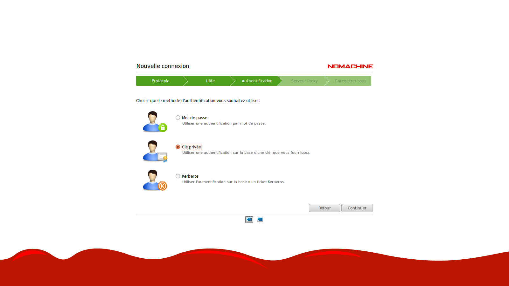

# BioLinux #

Bio-Linux 8 est une plate-forme puissante bioinformatique libres, poste de travail qui peut être installé sur quoi que ce soit à partir d'un ordinateur portable à un gros serveur, ou courir comme une machine virtuelle. Bio-Linux 8 ajoute plus de 250 paquets de bioinformatique à une base LTS Ubuntu Linux 14.04, fournissant environ 50 applications graphiques et plusieurs centaines d'outils de ligne de commande. L'environnement Galaxy pour l'analyse basée sur le navigateur des données et la construction de workflow est également incorporé dans Bio-Linux 8.

### Les versions

* BioLinux 8

### Les pré-requis pour déployer cette stack

* un accès internet
* un shell Linux
* un [compte Cloudwatt](https://www.cloudwatt.com/cockpit/#/create-contact), avec une [paire de clés existante](https://console.cloudwatt.com/project/access_and_security/?tab=access_security_tabs__keypairs_tab)
* les outils [OpenStack CLI](http://docs.openstack.org/cli-reference/content/install_clients.html)
* un clone local du dépôt git [Cloudwatt applications](https://github.com/cloudwatt/applications)

### Taille de l'instance

Par défaut, le script propose un déploiement sur une instance de type " Small " (s1.cw.small-1) en tarification à l'usage (les prix à l'heure et au mois sont disponibles sur la [page Tarifs](https://www.cloudwatt.com/fr/produits/tarifs.html) du site de Cloudwatt). Bien sur, vous pouvez ajuster les parametres de la stack et en particulier sa taille par défaut.

## Démarrage

### Initialiser l'environnement

Munissez-vous de vos identifiants Cloudwatt, et cliquez [ICI](https://console.cloudwatt.com/project/access_and_security/api_access/openrc/). Si vous n'êtes pas connecté, vous passerez par l'écran d'authentification, puis le téléchargement d'un script démarrera. C'est grâce à celui-ci que vous pourrez initialiser les accès shell aux API Cloudwatt.

Sourcez le fichier téléchargé dans votre shell. Votre mot de passe vous sera demandé.

~~~ bash
$ source COMPUTE-[...]-openrc.sh
Please enter your OpenStack Password:

~~~

Une fois ceci fait, les outils ligne de commande OpenStack peuvent interagir avec votre compte Cloudwatt.

### Démarrer une instance BioLinux

Dans un shell, lancer cette commande.

~~~bash
$ nova boot --flavor m1.tiny --image bundle-biolinux-8 --nic net-id=NET_ID --security-group your_sec_groupe --key-name your_key_pair your_instance_name
~~~

### Enjoy

Pour accéder à la machine, vous avez 2 choix :

1) Par ssh.
~~~bash
 $ ssh cloud@floating_ip -i your_key_pair.pem
~~~

2) Par client nomachine.
L'utilsateur est `cloud` et le mot de passe par défaut est `cloudwatt`.

Je vous conseille de changer le mot de passe par défaut en se connectant par ssh.

~~~bash
$ssh cloud@floating_ip -i your_key_pair.pem
$ passwd
~~~

#### Autres sources pouvant vous intéresser:

* [BioLinux homepage](http://environmentalomics.org/bio-linux/)

-----
Have fun. Hack in peace.
