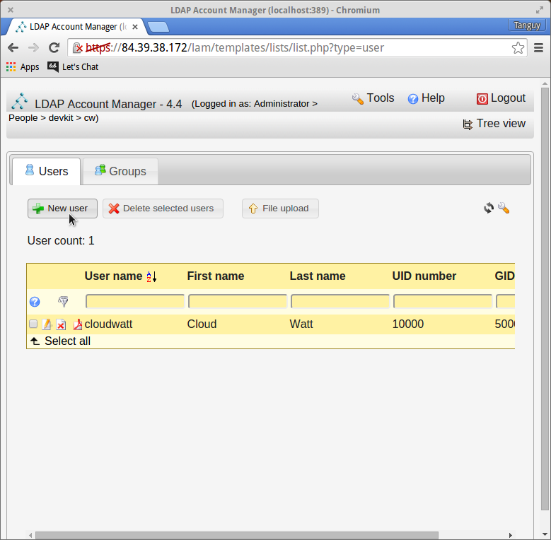
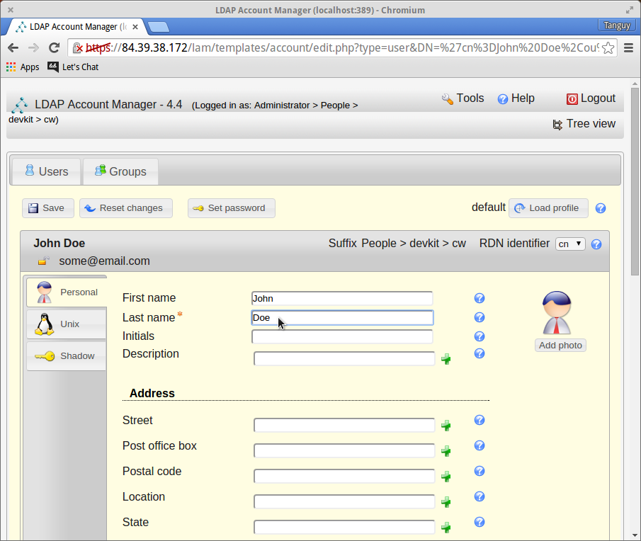
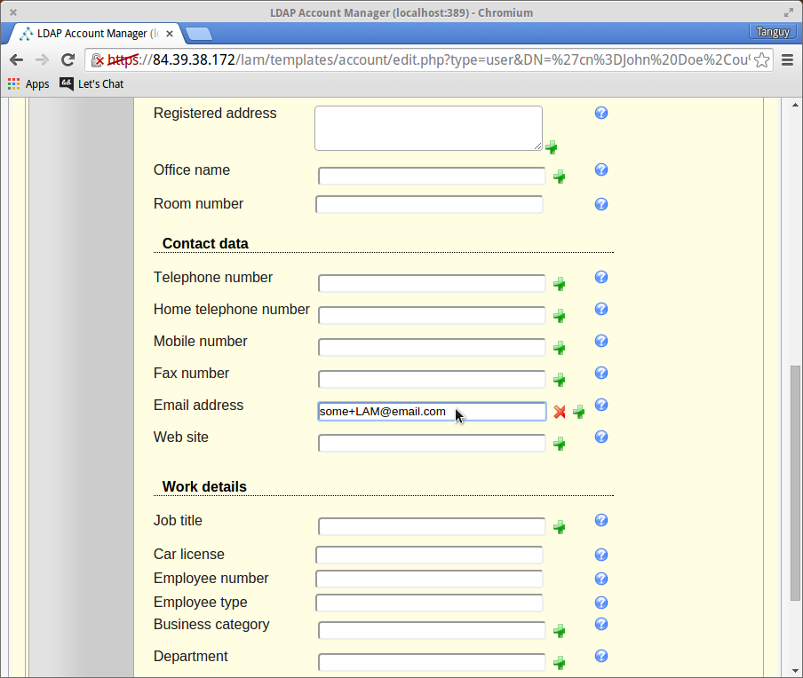
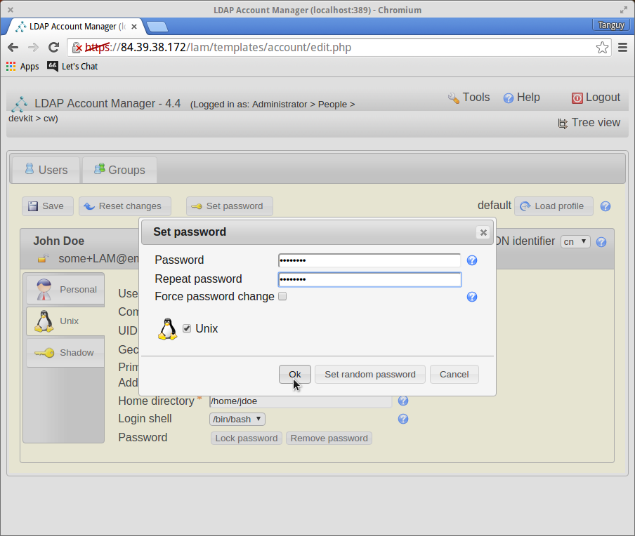

#### LAM

**LAM** se trouve au chemin `/lam` de votre instance, les mots de passe par défaut de
l'utilisateur *Administrator* ( *master password* et *server preferences* password) sont définis à **c10udw477**.

Vous pouvez maintenant créer votre premier compte. Le compte "cloudwatt" est déjà présent et est le compte
d'administration de LDAP. Il est vitale de changer son mot de passe mais délicat de modifier d'autres
attributs du compte. Cela pourrait avoir des effets néfastes sur le fonctionnement de LAM. Ne changez autre
chose que son mot de passe que si vous savez ce que vous faites.

Une fois sur la page de création de compte, entrez les détails de votre nouvel utilisateur. Sur le premier onglet
(Personal), la seule information obligatoire est le "last name", il vous faut également remplir l'email
qui est nécessaire pour GitLab, Dokuwiki et Let's Chatt. Une fois ceci fait, affichez l'onglet "Unix".

Les champs `User name` et `Common name` sont remplis avec des exemples générés par LAM. Remplacez les avec
 vos valeurs. `User name` sera votre identifiant pour tous les outils du DevKit. C'est le **seul champ qui ne
 peut être modifié à l'avenir**. Le champ `Common name` sera utilisé par les outils du DevKit pour faire référence
 à l'utilisateur.

N'enregistrez pas encore votre compte ! Avant cela, définissez le mot de passe utilisateur. Le bouton est
placé à droite du bouton de sauvegarde.

Vous pouvez générer un mot de passe aléatoire ou en rentrer un en dur. Quel que soit votre choix, les
modifications seront active après sauvegarde du compte. Si vous générez un mot de passe, pensez à le copier
quelques part avant la sauvegarde.

Bien, vous avez créé votre utilisateur. A l'avenir, les utilisateurs se connectant à LAM ne pourront modifier que
leur propre compte.

Avant de passer à la suite, **changez le mot de passe master et le mot de passe des préférences serveur**.

`Edit general settings`

`Edit server profiles`

