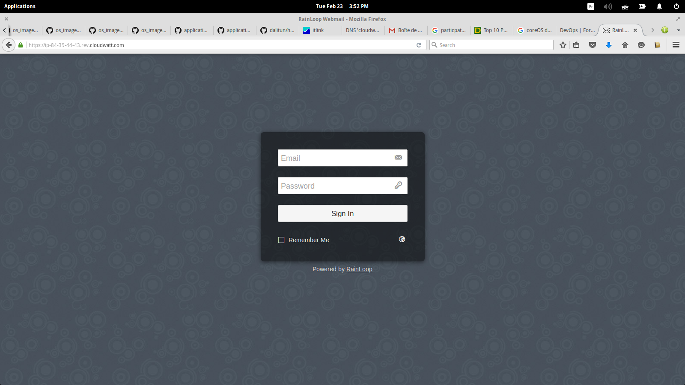

# 5 Minutes Stacks, 25 episode : Mail #

## Episode 20 : Mail

A mail server (also known as a mail transfer agent or MTA, a mail transport agent, a mail router or an Internet mailer) is an application that receives incoming e-mail from local users (people within the same domain) and remote senders and forwards outgoing e-mail for delivery. A computer dedicated to running such applications is also called a mail server. Microsoft Exchange and Postfix are among the more common mail server programs.
## Preparations

### The version
 - Ubuntu Trusty 14.04.3
 - Postfix 2.11.0
 - Dovecot 2.2.9
 - Clamsmtpd 1.10
 - Apache 2.4.7
 - rainloop

### The prerequisites to deploy this stack

 * an internet acces
 * a Linux shell
 * a [Cloudwatt account](https://www.cloudwatt.com/cockpit/#/create-contact), with an [existing keypair](https://console.cloudwatt.com/project/access_and_security/?tab=access_security_tabs__keypairs_tab)
 * the tools [OpenStack CLI](http://docs.openstack.org/cli-reference/content/install_clients.html)
 * a local clone of the git repository [Cloudwatt applications](https://github.com/cloudwatt/applications)

### Size of the instance

 Per default, the script is proposing a deployement on an instance type "Small" (s1.cw.small-1).  Instances are charged by the minute and capped at their monthly price (you can find more details on the [Tarifs page](https://www.cloudwatt.com/fr/produits/tarifs.html) on the Cloudwatt website). Obviously, you can adjust the stack parameters, particularly its defaut size.

### By the way...

 If you do not like command lines, you can go directly to the "run it thru the console" section by clicking [here](#console)

## What will you find in the repository

 Once you have cloned the github, you will find in the `bundle-trusty-mail/` repository:

 * `bundle-trusty-mail.heat.yml`: HEAT orchestration template. It will be use to deploy the necessary infrastructure.
 * `stack-start.sh`: Stack launching script. This is a small script that will save you some copy-paste.
 * `stack-get-url.sh`: Flotting IP recovery script.

## Start-up

### Initialize the environment

 Have your Cloudwatt credentials in hand and click [HERE](https://console.cloudwatt.com/project/access_and_security/api_access/openrc/).
 If you are not logged in yet, you will go thru the authentication screen then the script download will start. Thanks to it, you will be able to initiate the shell accesses towards the Cloudwatt APIs.

 Source the downloaded file in your shell. Your password will be requested.

 ~~~ bash
 $ source COMPUTE-[...]-openrc.sh
 Please enter your OpenStack Password:

 ~~~

 Once this done, the Openstack command line tools can interact with your Cloudwatt user account.

### Adjust the parameters

 With the `bundle-trusty-mail.heat.yml` file, you will find at the top a section named `parameters`. The sole mandatory parameter to adjust is the one called `keypair_name`. Its `default` value must contain a valid keypair with regards to your Cloudwatt user account. This is within this same file that you can adjust the instance size by playing with the `flavor` parameter.

 ~~~ yaml
 heat_template_version: 2013-05-23

 description: Basic all-in-one MAIL stack

 parameters:
   keypair_name:
     default: keypair_name        <-- Indicate here your keypair
     description: Keypair to inject in instances
     type: string

   flavor_name:
     default: s1.cw.small-1              <-- indicate here the flavor size
     description: Flavor to use for the deployed instance
     type: string
     constraints:
       - allowed_values:
           - s1.cw.small-1
           - n1.cw.standard-1
           - n1.cw.standard-2
           - n1.cw.standard-4
           - n1.cw.standard-8
           - n1.cw.standard-12

           - n1.cw.standard-16
 [...]
 ~~~

 In a shell, run the script `stack-start.sh`:

 ~~~ bash
 $ ./stack-start.sh your_stack_name your_keypair_name
 Enter your new admin password:
 Enter your new password once more:
 Creating stack...
 +--------------------------------------+------------+--------------------+----------------------+
 | id                                   | stack_name | stack_status       | creation_time        |
 +--------------------------------------+------------+--------------------+----------------------+
 | xixixx-xixxi-ixixi-xiixxxi-ixxxixixi | your_stack_name | CREATE_IN_PROGRESS | 2025-10-23T07:27:69Z |
 +--------------------------------------+------------+--------------------+----------------------+
 ~~~

 Within 5 minutes the stack will be fully operational. (Use watch to see the status in real-time)

 ~~~ bash
 $ watch -n 1 heat stack-list
 +--------------------------------------+------------+-----------------+----------------------+
 | id                                   | stack_name | stack_status    | creation_time        |
 +--------------------------------------+------------+-----------------+----------------------+
 | xixixx-xixxi-ixixi-xiixxxi-ixxxixixi | your_stack_name | CREATE_COMPLETE | 2025-10-23T07:27:69Z |
 +--------------------------------------+------------+-----------------+----------------------+
 ~~~

### Enjoy
Once all this makes you can connect via a Web browser on Rainloop:

http://yourDomainaName , https://yourDomainaName or http://floatingIP/

You have to arrive on this page:

For logging you have to use Linux users and you begin to send and recieve emails.

In this exemple we used the default domain name provided by cloudwatt (`https://ip-floatingip.rev.cloudwatt.com` by replacing your "." by "-" in floatingIP ( example: ip-10-11-12-13.rev.cloudwatt.com )),
if you wanna change it :
you have to edit `/etc/postfix/main.cf`, `/etc/apache2/sites-available/vhost.conf` and `/var/www/cw/data/_data_/_default_/domains/domain.ini`

then restart the services postfix,dovecot and apache2:

~~~ bash
# service postfix restart
# initctl restart dovecot
# service apache2 restart
~~~
Make a refresh on the url http://floatingIP/

If you want to change same configurations on your rainloop:
 Access to (http://yourDomainaName , https://yourDomainaName or http://floatingIP)/?admin" with web browser on Client, then login with a user and password for initial login, user is "admin" and password is "12345"
 
  Don't froget to change password 's admin

An SSL certificate is automatically generated via Let's encrypt and it is renewed via a CRON job every 90 days.

The updates ClamAv signatures is via cron everyday.

###So watt?
The interesting directories and files are:

`/etc/apache2`: Apache configuration files

`/etc/postfix`: Postfix configuration files

`/etc/dovecot`: Dovecot configuration files

`/etc/clamsmtpd.conf`:ClamAv configuration file

`/var/www/cw/data/_data_/_default_/`: Rainloop configuration files

#### Other resources you could be interested in:
* [ Postfix Home page](http://www.postfix.org/documentation.html)
* [ Dovecot Documentation](http://www.dovecot.org/)
* [ Rainloop Documentation](http://www.rainloop.net)
* [ ClamAv Documentation](http://www.clamav.net/)

-----------
