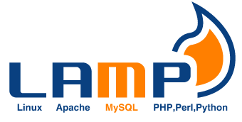

# 5 Minutes Stacks, épisode 56 : LAMP #

## Episode 56 : Linux-Apache-MySQL-PHP7

La base de déploiement est une instance Ubuntu Xenial. Les serveurs Apache et MySQL sont
déployés dans une instance unique. 

### Les versions

* Ubuntu 16.04
* Apache 2.4.18
* MySQL 5.7.17
* PHP 7.0.15

## Vous n’auriez pas un moyen de lancer l’application en 1-clic ?

Bon... en fait oui ! Allez sur la page [Applications](https://www.cloudwatt.com/fr/applications/index.html) du site de Cloudwatt, choisissez l'appli, appuyez sur DEPLOYER et laisser vous guider... 2 minutes plus tard un bouton vert apparait... ACCEDER : Coder maintenant !

## C’est bien tout ça, mais vous n’auriez pas un moyen de lancer l’application par la console ?

Et bien si ! En utilisant la console, vous pouvez déployer un serveur LAMP :

1.	Allez sur le Github Cloudwatt dans le répertoire applications/bundle-xenial-lamp
2.	Cliquez sur le fichier nommé bundle-xenial-lamp.heat.yml
3.	Cliquez sur RAW, une page web apparait avec le détail du script
4.	Enregistrez-sous le contenu sur votre PC dans un fichier avec le nom proposé par votre navigateur (enlever le .txt à la fin)
5.  Rendez-vous à la section « [Stacks](https://console.cloudwatt.com/project/stacks/) » de la console.
6.	Cliquez sur « Lancer la stack », puis cliquez sur « fichier du modèle » et sélectionnez le fichier que vous venez de sauvegarder sur votre PC, puis cliquez sur « SUIVANT »
7.	Donnez un nom à votre stack dans le champ « Nom de la stack »
8.	Entrez votre keypair dans le champ « keypair_name »
9.	Choisissez la taille de votre instance parmi le menu déroulant « flavor_name » et cliquez sur « LANCER »

La stack va se créer automatiquement (vous pouvez en voir la progression cliquant sur son nom). Quand tous les modules deviendront « verts », la création sera terminée. Vous pourrez alors aller dans le menu « Instances » pour découvrir l’IP flottante qui a été générée automatiquement. Ne vous reste plus qu’à lancer votre IP dans votre navigateur.

C’est (déjà) FINI !

## Installation en CLI

Si vous n'aimez que la ligne de commande, vous pouvez passer directement à la version "lancement en CLI" en cliquant sur [ce lien](#cli)

## So watt ?

Ce tutoriel a pour but d'accélerer votre démarrage. A ce stade vous êtes maître(sse) à bord. 

Vous avez un point d'entrée sur votre machine virtuelle en SSH via l'IP flottante exposée et votre clé privée (utilisateur `cloud` par défaut).

Vous pouvez commencer à construire votre site en prenant la main sur votre serveur. Les points d'entrée utiles :

* `/etc/apache2/sites-available/default-cw.conf` : configuration Apache par défaut 
* `/var/www/cw` : le répertoire de déploiement du mini site php d'exemple

<a name="cli" />

## Installation en CLI

Si vous n'aimez que la ligne de commande, vous pouvez passer directement à la version "lancement en CLI" en cliquant sur [ce lien](#cli)

### Les pré-requis pour déployer cette stack

* un accès internet
* un shell Linux
* un [compte Cloudwatt](https://www.cloudwatt.com/cockpit/#/create-contact), avec une [paire de clés existante](https://console.cloudwatt.com/project/access_and_security/?tab=access_security_tabs__keypairs_tab)
* les outils [OpenStack CLI](http://docs.openstack.org/cli-reference/content/install_clients.html)
* un clone local du dépôt git [Cloudwatt applications](https://github.com/cloudwatt/applications)

### Taille de l'instance

Par défaut, le script propose un déploiement sur une instance de type " Small " (s1.cw.small-1) en tarification à l'usage (les prix à l'heure et au mois sont disponibles sur la [page Tarifs](https://www.cloudwatt.com/fr/produits/tarifs.html) du site de Cloudwatt). Bien sur, vous pouvez ajuster les parametres de la stack et en particulier sa taille par défaut. 

### Au fait...

Si vous n’aimez pas les lignes de commande, vous pouvez passer directement à la version « lancement par la console » en cliquant sur [ce lien](#console) 

### Tour du propriétaire

Une fois le repository cloné, vous trouvez, dans le répertoire `bundle-xenial-lamp/`:

* `bundle-xenial-lamp.heat.yml` : Template d'orchestration HEAT, qui va servir à déployer l'infrastructure nécessaire.
* `stack-start.sh` : Script de lancement de la stack. C'est un micro-script pour vous économiser quelques copier-coller.
* `stack-get-url.sh` : Script de récupération de l'IP d'entrée de votre stack.

### Démarrage

### Initialiser l'environnement

Munissez-vous de vos identifiants Cloudwatt, et cliquez [ICI](https://console.cloudwatt.com/project/access_and_security/api_access/openrc/). Si vous n'êtes pas connecté, vous passerez par l'écran d'authentification, puis le téléchargement d'un script démarrera. C'est grâce à celui-ci que vous pourrez initialiser les accès shell aux API Cloudwatt.

Sourcez le fichier téléchargé dans votre shell. Votre mot de passe vous sera demandé. 

~~~ bash
$ source COMPUTE-[...]-openrc.sh
Please enter your OpenStack Password:

~~~

Une fois ceci fait, les outils ligne de commande OpenStack peuvent interagir avec votre compte Cloudwatt.

### Ajuster les paramètres

Dans le fichier `bundle-xenial-lamp.heat.yml` vous trouverez en haut une section `parameters`. Le seul paramètre obligatoire à ajuster est celui nommé `keypair_name` dont la valeur `default` doit contenir le nom d'une paire de clés valide dans votre compte utilisateur.
C'est dans ce même fichier que vous pouvez ajuster la taille de l'instance par le paramètre `flavor`.

~~~ yaml
heat_template_version: 2015-04-30

description: Basic all-in-one LAMP stack

parameters:
  keypair_name:
    default: amaury-ext-compute         <-- Mettez ici le nom de votre paire de clés
    description: Keypair to inject in instances
    type: string

  flavor_name:
    default: s1.cw.small-1              <-- Mettez ici l'identifiant de votre flavor
    description: Flavor to use for the deployed instance
    type: string
    constraints:
      - allowed_values:
          - s1.cw.small-1
          - n1.cw.standard-1
          - n1.cw.standard-2
          - n1.cw.standard-4
          - n1.cw.standard-8
          - n1.cw.standard-12
          - n1.cw.standard-16

[...]
~~~

### Démarrer la stack

Dans un shell, lancer le script `stack-start.sh` en passant en paramètre le nom que vous souhaitez lui attribuer :

~~~
./stack-start.sh MA_LAMPE
~~~

Enfin, attendez 5 minutes que le déploiement soit complet.

Le script `start-stack.sh` s'occupe de lancer les appels nécessaires sur les API Cloudwatt pour :

* démarrer une instance basée sur Ubuntu Xenial Tahr, pré-provisionnée avec la stack LAMP
* l'exposer sur Internet via une IP flottante

### Enjoy

Une fois tout ceci fait, vous pouvez lancez le script `stack-get-url.sh` qui va récupérer l'url d'entrée de votre stack.

-----
Have fun. Hack in peace.
