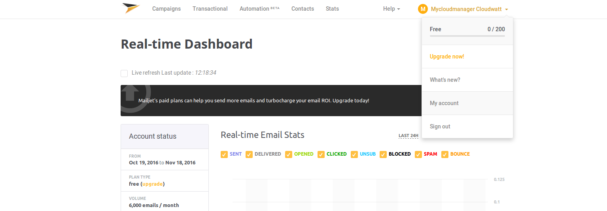
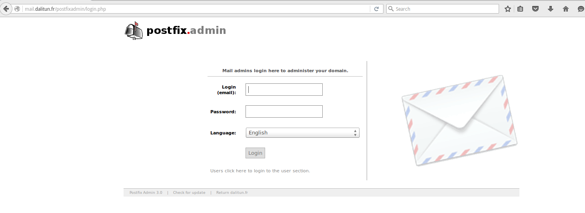

# 5 Minutes Stacks, épisode 40 : Webmail with email providers(Smtp relay) #

## Episode 40 :  Webmail with email providers

Un serveur de messagerie électronique est un logiciel serveur de courrier électronique (courriel). Il a pour vocation de transférer les messages électroniques d'un serveur à un autre. Un utilisateur n'est jamais en contact direct avec ce serveur mais utilise soit un client de messagerie, soit un Webmail, qui se charge de contacter le serveur pour envoyer ou recevoir les messages.
Dans cet episode nous avons utilisé Rainloop comme webmail opensource qui est développé en PHP et qui se veut complet et simple d'utilisation. Il gère très bien les protocoles IMAP/SMTP et dispose d'une interface moderne (HTML5/CSS3) très érgonomique, c'est plutôt agréable. Du côté des fonctionnalités, on retrouve toutes celles d'un client mail classique, avec en plus un système de plugins.

Dans cet épisode, nous allons vous montrer comment monter votre stack webmail en utilisant un email service provides comme Mailjet.
Il y a plusieurs email service providers comme Sendgrid, Mandrill, Sendy ...

## Preparations

### Les versions
 - Ubuntu Xenial 16.04
 - Postfix 3.1.0
 - Postfixadmin 3.0
 - Dovecot 2.2.22
 - Apache 2.4.18
 - Mysql 5.7.16
 - Roundcube

### Les pré-requis pour déployer cette stack
Ceci devrait être une routine à présent:

* Un accès internet
* Un shell linux
* Un [compte Cloudwatt](https://www.cloudwatt.com/cockpit/#/create-contact) avec une [ paire de clés existante](https://console.cloudwatt.com/project/access_and_security/?tab=access_security_tabs__keypairs_tab)
* Les outils [OpenStack CLI](http://docs.openstack.org/cli-reference/content/install_clients.html)
* Un clone local du dépôt git [Cloudwatt applications](https://github.com/cloudwatt/applications)

### Taille de l'instance
Par défaut, le script propose un déploiement sur une instance de type "Standard" (n2.cw.standard-1). Il
existe une variété d'autres types d'instances pour la satisfaction de vos multiples besoins. Les instances sont facturées à la minute, vous permettant de payer uniquement pour les services que vous avez consommés et plafonnées à leur prix mensuel (vous trouverez plus de détails sur la [Page tarifs](https://www.cloudwatt.com/fr/produits/tarifs.html) du site de Cloudwatt).

Vous pouvez ajuster les parametres de la stack à votre goût.

### Au fait...

Si vous n’aimez pas les lignes de commande, vous pouvez passer directement à la version ["Je lance avec la console"](#console)...

## Tour du propriétaire

Une fois le dépôt cloné, vous trouverez le répertoire `bundle-xenial-webmail-with-email-providers/`

* `bundle-xenial-webmail-with-email-providers.heat.yml`: Template d'orchestration HEAT, qui servira à déployer l'infrastructure nécessaire.
* `stack-start.sh`: Scipt de lancement de la stack, qui simplifie la saisie des parametres et sécurise la création du mot de passe admin.
* `stack-get-url.sh`: Script de récupération de l'IP d'entrée de votre stack, qui peut aussi se trouver dans les parametres de sortie de la stack.

## Démarrage

### Initialiser l'environnement

Munissez-vous de vos identifiants Cloudwatt, et cliquez [ICI](https://console.cloudwatt.com/project/access_and_security/api_access/openrc/).
Si vous n'êtes pas connecté, vous passerez par l'écran d'authentification, puis le téléchargement d'un script démarrera. C'est grâce à celui-ci que vous pourrez initialiser les accès shell aux API Cloudwatt.

Sourcez le fichier téléchargé dans votre shell et entrez votre mot de passe lorsque vous êtes invité à utiliser les clients OpenStack.

~~~ bash
$ source COMPUTE-[...]-openrc.sh
Please enter your OpenStack Password:

~~~

Une fois ceci fait, les outils de ligne de commande d'OpenStack peuvent interagir avec votre compte Cloudwatt.

### Ajuster les paramètres

Dans le fichier `bundle-xenial-webmail-with-email-providers.heat.yml` vous trouverez en haut une section `parameters`. Le seul paramètre obligatoire à ajuster est celui nommé `keypair_name` dont la valeur `default` doit contenir le nom d'une paire de clés valide dans votre compte utilisateur.
C'est dans ce même fichier que vous pouvez ajuster la taille de l'instance par le paramètre `flavor`.

~~~ yaml
[...]
parameters:
  keypair_name:
    description: Keypair to inject in instance
    label: SSH Keypair
    type: string
    default: my-keypair-name                  <-- Mettez ici le nom de votre keypair
  admin_pass:
    description: admin password
    label: admin password
    type: string
    default: changeme                         <-- Mettez ici le mot de passe de votre base de données
  mail_domain:
    description: mail domain
    label: mail domain
    type: string
    default: exemple.com                       <-- Mettez ici votre nom de domaine
  hostname:
     description: host name machine
     label: hostname
     type: string
     default: mail                             <-- Mettez ici votre nom de la machine
  smtp_server:
     description: smtp server Mailjet or SenGrid
     label: relay SMTP
     type: string
     default: in-v3.mailjet.com                <-- Mettez ici le nom du serveur smtp relay
  smtp_username:
     description: Username (API Key)
     label: Username (API Key)
     type: string
     default: xxxxxxxxxxxxxxxxxxxxxxxxxxxxx    <-- Mettez ici l'username (API Key)
  smtp_password:
     description: Password (Secret Key)
     label: Password (Secret Key)
     type: string
     default: xxxxxxxxxxxxxxxxxxxxxxxxxxxxxx   <-- Mettez ici le password (Secret Key)
  flavor_name:
    default: n2.cw.standard-1
    description: Flavor to use for the deployed instance
    type: string
    label: Openstack Flavor
    constraints:
      - allowed_values:
        - t1.cw.tiny
        - s1.cw.small-1
        - n2.cw.standard-1
        - n2.cw.standard-2
        - n2.cw.standard-4
        - n2.cw.standard-8
        - n2.cw.standard-16
        - n2.cw.highmem-2
        - n2.cw.highmem-4
        - n2.cw.highmem-8
        - n2.cw.highmem-16
[...]
~~~
### Démarrer la stack

Dans un shell,lancer le script `stack-start.sh`:

~~~
./stack-start.sh nom_de_votre_stack
~~~
Exemple :

~~~bash
$ ./stack-start.sh EXP_STACK
+--------------------------------------+-----------------+--------------------+----------------------+
| id                                   | stack_name      | stack_status       | creation_time        |
+--------------------------------------+-----------------+--------------------+----------------------+
| ee873a3a-a306-4127-8647-4bc80469cec4 | nom_de_votre_stack       | CREATE_IN_PROGRESS | 2016-11-04T11:03:51Z |
+--------------------------------------+-----------------+--------------------+----------------------+
~~~

Puis attendez **5 minutes** que le déploiement soit complet.

~~~bash
$ heat resource-list nom_de_votre_stack
+------------------+-----------------------------------------------------+---------------------------------+-----------------+----------------------+
| resource_name    | physical_resource_id                                | resource_type                   | resource_status | updated_time         |
+------------------+-----------------------------------------------------+---------------------------------+-----------------+----------------------+
| floating_ip      | 44dd841f-8570-4f02-a8cc-f21a125cc8aa                | OS::Neutron::FloatingIP         | CREATE_COMPLETE | 2016-11-04T11:03:51Z |
| security_group   | efead2a2-c91b-470e-a234-58746da6ac22                | OS::Neutron::SecurityGroup      | CREATE_COMPLETE | 2016-11-04T11:03:52Z |
| network          | 7e142d1b-f660-498d-961a-b03d0aee5cff                | OS::Neutron::Net                | CREATE_COMPLETE | 2016-11-04T11:03:56Z |
| subnet           | 442b31bf-0d3e-406b-8d5f-7b1b6181a381                | OS::Neutron::Subnet             | CREATE_COMPLETE | 2016-11-04T11:03:57Z |
| server           | f5b22d22-1cfe-41bb-9e30-4d089285e5e5                | OS::Nova::Server                | CREATE_COMPLETE | 2016-11-04T11:04:00Z |
| floating_ip_link | 44dd841f-8570-4f02-a8cc-f21a125cc8aa-`floating IP`  | OS::Nova::FloatingIPAssociation | CREATE_COMPLETE | 2016-11-04T11:04:30Z |
+------------------+-----------------------------------------------------+---------------------------------+-----------------+----------------------
~~~

Le script `start-stack.sh` s'occupe de lancer les appels nécessaires sur les API Cloudwatt pour :

* démarrer une instance basée sur Ubuntu xenial, pré-provisionnée avec la stack Webmail
* l'exposer sur Internet via une IP flottante

## C’est bien tout ça,
### mais vous n’auriez pas un moyen de lancer l’application par la console ?

Et bien si ! En utilisant la console, vous pouvez déployer un serveur mail:

1.	Allez sur le Github Cloudwatt dans le répertoire [applications/bundle-xenial-webmail-with-email-providers](https://github.com/cloudwatt/applications/tree/master/bundle-xenial-webmail-with-email-providers)
2.	Cliquez sur le fichier nommé `bundle-xenial-webmail-with-email-providers.heat.yml`
3.	Cliquez sur RAW, une page web apparait avec le détail du script
4.	Enregistrez-sous le contenu sur votre PC dans un fichier avec le nom proposé par votre navigateur (enlever le .txt à la fin)
5.  Rendez-vous à la section « [Stacks](https://console.cloudwatt.com/project/stacks/) » de la console.
6.	Cliquez sur « Lancer la stack », puis cliquez sur « fichier du modèle » et sélectionnez le fichier que vous venez de sauvegarder sur votre PC, puis cliquez sur « SUIVANT »
7.	Donnez un nom à votre stack dans le champ « Nom de la stack »
8.	Entrez votre keypair dans le champ « keypair_name »
9.  Donner votre passphrase qui servira pour le chiffrement des sauvegardes
10.	Choisissez la taille de votre instance parmi le menu déroulant « flavor_name » et cliquez sur « LANCER »

La stack va se créer automatiquement (vous pouvez en voir la progression cliquant sur son nom). Quand tous les modules deviendront « verts », la création sera terminée. Vous pourrez alors aller dans le menu « Instances » pour découvrir l’IP flottante qui a été générée automatiquement. Ne vous reste plus qu'à vous connecter en ssh avec votre keypair.

C’est (déjà) FINI !

### Vous n’auriez pas un moyen de lancer l’application en 1-clic ?

Bon... en fait oui ! Allez sur la page [Applications](https://www.cloudwatt.com/fr/applications/index.html) du site de Cloudwatt, choisissez l'appli, appuyez sur DEPLOYER et laisser vous guider... 2 minutes plus tard un bouton vert apparait... ACCEDER : vous avez votre Webmail !

## Enjoy

Une fois tout ceci est fait vous pouvez vous connecter sur l'inteface de roundcube via un navigateur web à partir de cet url `http://hostname.mail_domain/` ou `http://floatingIP/` pour s'authentifier vous utilisez le login **admin@mail_domain** et le password  **password_admin**, vous devez arriver sur ces pages.

Avant de commencer à envoyer et recevoir vos emails, autorisez vos boites email à partir de la plateforme d'email provider (dans notre cas [Mailjet](https://app.mailjet.com/signup)), suivez les etapes suivantes:

Vous vous connectez avec votre email et votre mot de passe vous arrivez sur cette page.

Puis cliquez sur `My account`.

Ensuite cliquez sur `Add a Sender Domain or Address` afin d'autorisez une boite email ou tous les boites emails de votre domaines pour qu'ils puissent envoyer et recevoir des emails.

Pour ajouter des utilisateurs(des boites emails), vous pouvez vous connecter sur l'inteface de postfixamdin via un navigateur web à partir de cet url `https://hostname.mail_domain/postfixadmin` ou `https://floatingIP/postfixadmin`  pour s'authentifier vous utilisez le login **admin@mail_domain** et le password  **password_admin**:

Pour savoir comment administrer le postfixadmin vous pouvez consulter ce lien
[postfixadmin](http://postfixadmin.sourceforge.net/screenshots/).

## So watt?

Les chemins intéressants sur votre machine :

`/etc/apache2`: Fichiers de configuration Apache

`/etc/postfix`: Fichiers de configuration Postfix

`/etc/dovecot`: Fichiers de configuration Dovecot

`/var/www/cw`: Dossier de Roundcube et postfixadmin

### Autres sources pouvant vous intéresser:
* [ Postfix Home page](http://www.postfix.org/documentation.html)
* [ Dovecot Documentation](http://www.dovecot.org/)
* [ Roundcube Documentation](https://roundcube.net/)
* [ Postfixadmin Documentation ](http://postfixadmin.sourceforge.net/)

----
Have fun. Hack in peace.
